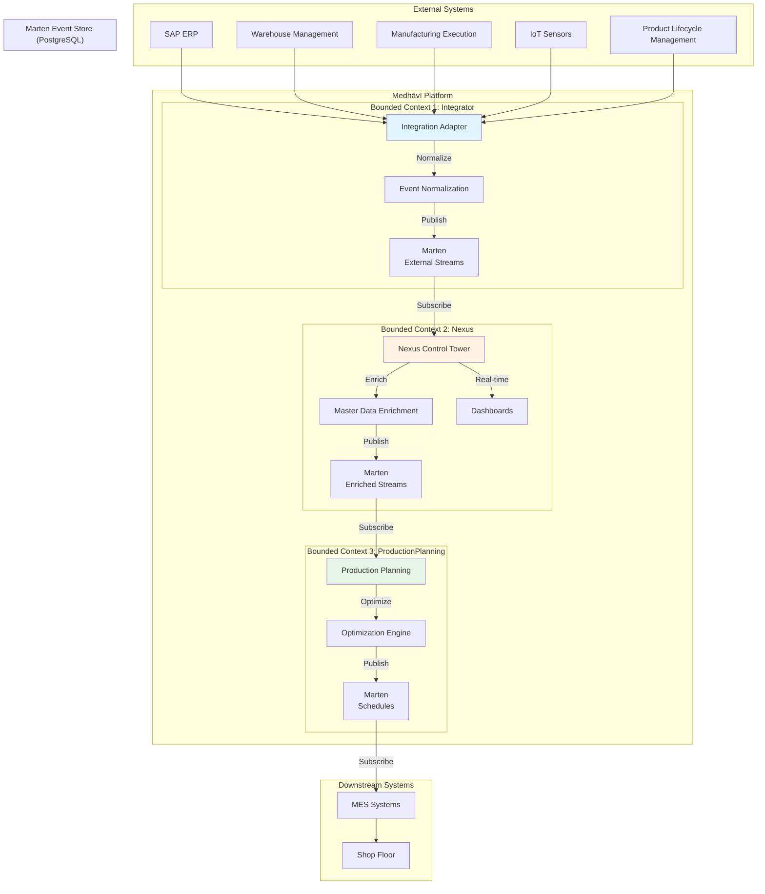
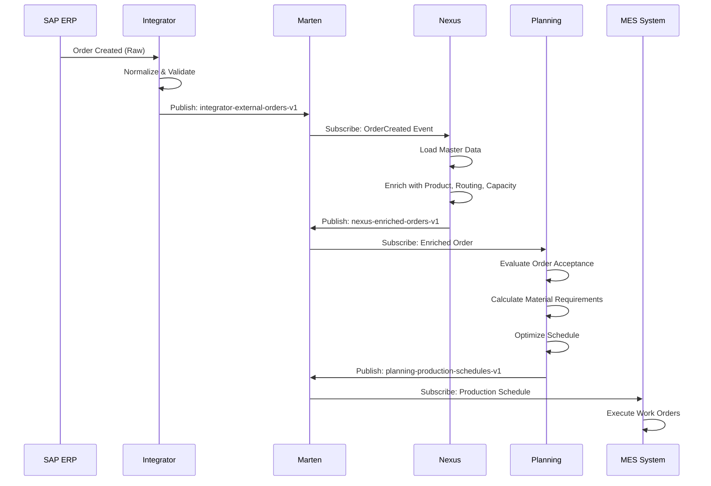
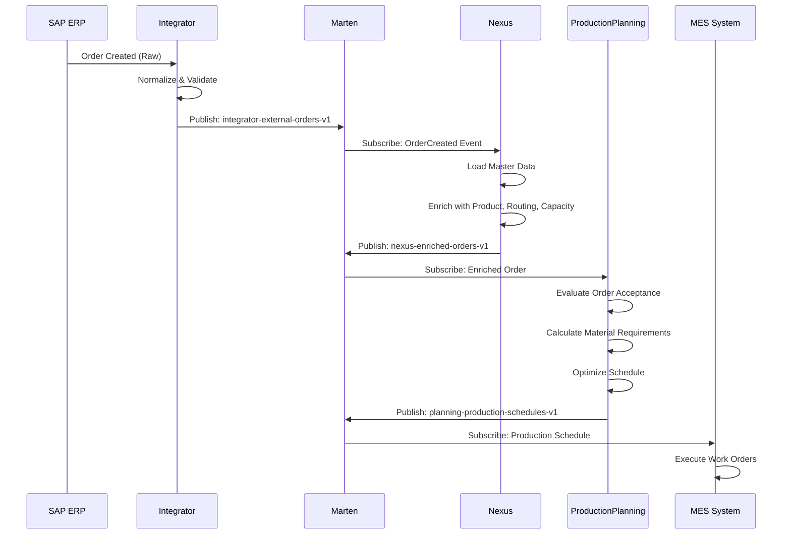
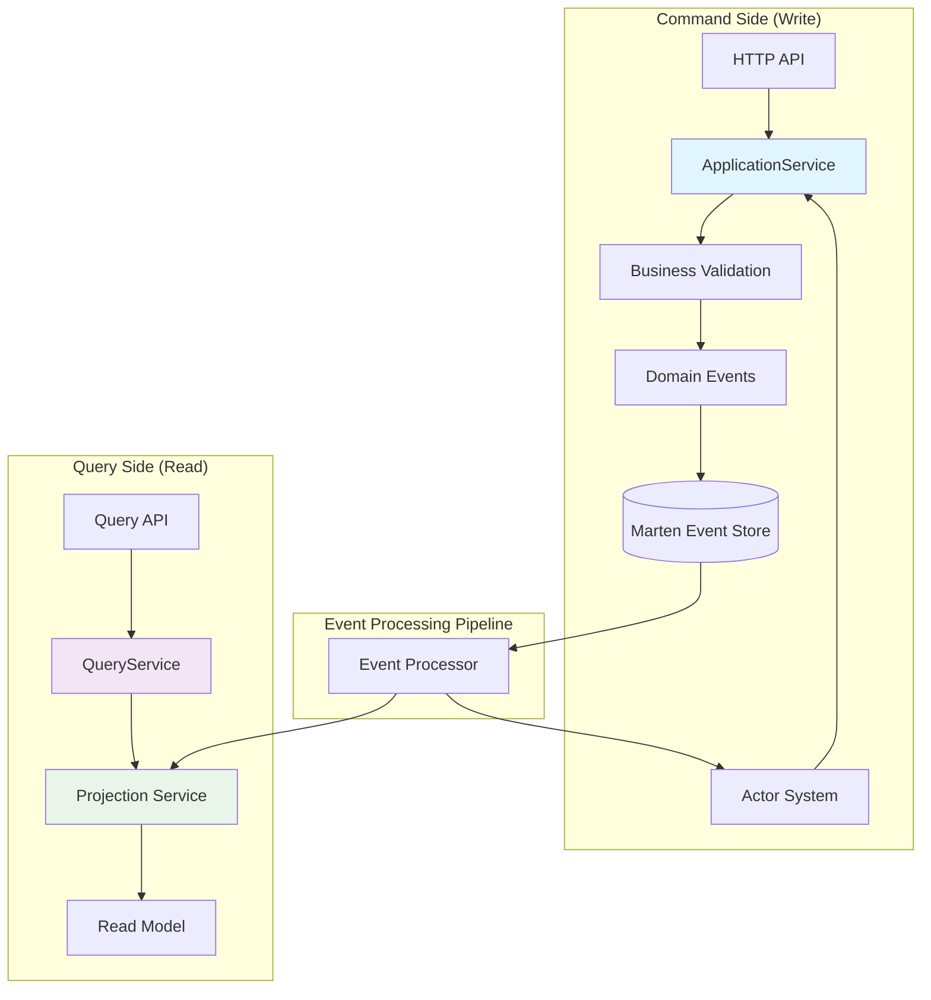
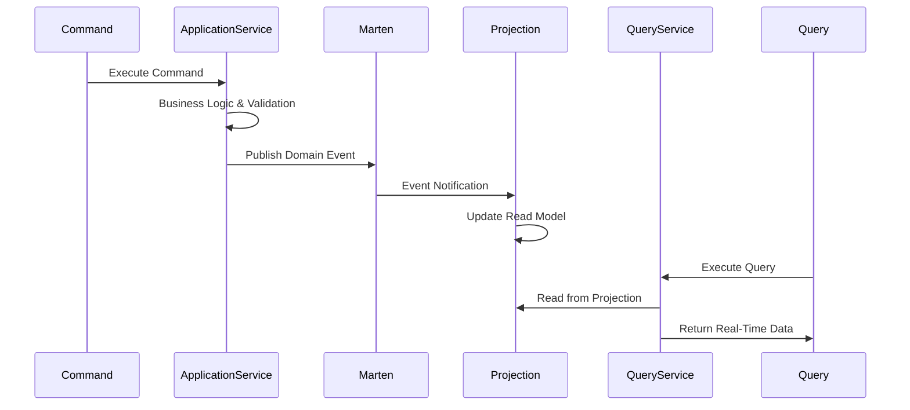
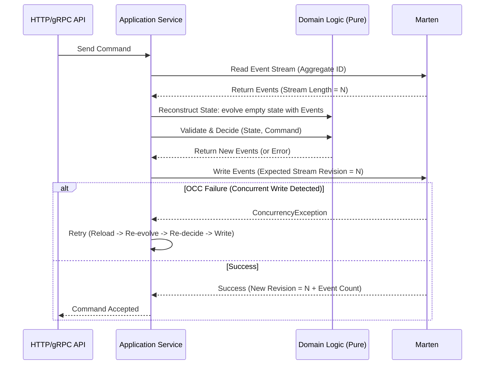
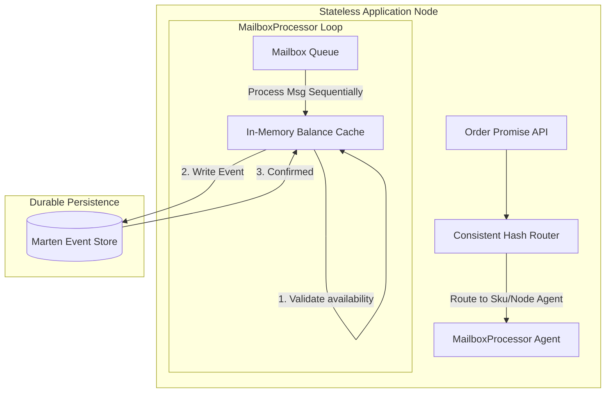
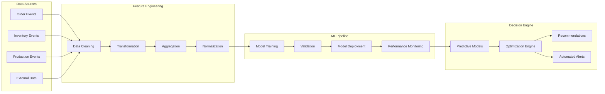

# Medhāvī Architecture Documentation

**Document Version**: 1.0  
**Last Updated**: May 25, 2026  
**Review Cycle**: Monthly  
**Architecture Owner**: Medhāvī Development Team

---

## Table of Contents

1. [Introduction](#1-introduction)
2. [Architecture Principles](#2-architecture-principles)
3. [Bounded Contexts & Three-System Architecture](#3-bounded-contexts--three-system-architecture)
4. [Layered Architecture & Project Structure](#4-layered-architecture--project-structure)
5. [Event Model & Messaging](#5-event-model--messaging)
6. [CQRS, Projections & Concurrency Model](#6-cqrs-projections--concurrency-model)
7. [Data & Persistence Architecture](#7-data--persistence-architecture)
8. [System-Level Concerns](#8-system-level-concerns)
9. [AI/ML & Optimization Integration](#9-aiml--optimization-integration)
10. [Deployment & Environments](#10-deployment--environments)
11. [Implementation Status](#11-implementation-status)

---

## 1. Introduction

### Product Description

**Medhāvī** is an intelligent supply chain orchestration platform that leverages event-driven architecture, artificial intelligence, and advanced optimization algorithms to provide real-time supply chain management and decision support. The system ingests events from diverse sources (ERP, WMS, IoT sensors, external systems), processes them through stateless write pipelines and local MailboxProcessor agents, and orchestrates complex workflows across multiple bounded contexts.

### Core Purpose

- **Real-time Event Processing**: Ingest and process supply chain events with sub-second latency
- **Intelligent Orchestration**: Use AI/ML for demand forecasting, inventory optimization, and automated decision-making
- **Event Sourcing**: Maintain complete audit trails and enable temporal queries
- **Scalable Architecture**: Handle millions of events daily with horizontal scaling

### High-Level Goals

- **99.9% Uptime**: Enterprise-grade reliability for critical supply chain operations
- **Sub-200ms Latency**: Real-time responsiveness for time-sensitive decisions
- **Zero Data Loss**: Guaranteed event persistence and replay capabilities
- **AI-Driven Insights**: Machine learning models for predictive analytics and optimization
- **Multi-tenant Scalability**: Support for multiple supply chain networks

### Augmented Intelligence Philosophy

Medhāvī emphasizes human-centric AI. Routine monitoring and recommendations are automated, while strategic decisions remain with humans. AI assistants provide contextual recommendations and clear explanations, with all critical actions human-validated. This aligns with trends of responsible AI and human-on-the-loop design.

---

## 2. Architecture Principles

### Domain-Driven Design (DDD)

**Core Principle**: All architecture decisions must be validated against DDD principles.

- **Bounded Contexts**: Clear separation between master data (MasterData) and planning (Planning)
- **Aggregates**: Must represent transaction boundaries with business invariants
- **Ubiquitous Language**: Code must reflect business terminology
- **Anti-Corruption Layer (ACL)**: Always validate external data before domain processing

**Key Bounded Contexts**:
- **Integration**: Data ingestion and normalization from external systems
- **Nexus**: Master data management and control tower
- **Planning**: Advanced planning and optimization algorithms

                    ┌──────────────────────┐
                    │       Master         │
                    │ (Topology & Rules)   │
                    └─────────┬────────────┘
                              │ Published Language
                              ▼
                    ┌──────────────────────┐
                    │       Demand         │
                    └─────────┬────────────┘
                              │ Demand Events
                              ▼
                    ┌──────────────────────┐
                    │    Supply    │
                    │ (Material + Bucket   │
                    │   Capacity Balance)  │
                    └───────┬────────┬─────┘
                            │        │
                  PlannedOrders   TransferProposals
                            │        │
                            ▼        ▼
                   ┌────────────┐  ┌──────────────┐
                   │ Scheduling │  │  Transport   │
                   └──────┬─────┘  └──────┬───────┘
                          │               │
                   ScheduleRun      ShipmentPlan
                          │               │
                          └──────┬────────┘
                                 ▼
                         ┌────────────────┐
                         │   Execution    │
                         └────────────────┘


Fast Path:

MasterData → Supply Projection → Reservation (ATP)

| Context          | Owns Invariant                                | Main Entities                                          |
| ---------------- | --------------------------------------------- | ------------------------------------------------------ |
| **SharedKernel** | Primitive identity safety                     | NodeId, SkuId, Period, Qty, Money                      |
| **MasterData**   | BOM, Route, Resource calendar integrity       | Product, BOM, Routing, Resource, Calendar, Lane        |
| **Demand**       | Demand lifecycle and allocation consistency   | Forecast, CustomerOrder                                |
| **Capacity**     | Resource capacity allocations & CTP bounds    | CapacityBucket, CapacityAllocation                     |
| **Supply**       | Material balance and inventory positions      | InventoryPosition, PlannedOrder                        |
| **Scenario**     | Version isolation and pegging snapshots       | Scenario, Branch, PeggingLink                          |
| **Contracts**    | Lightweight contract boundary DTOs            | PromiseRequest, PromiseResponse                        |
| **Integration**  | Ingest normalization and external command ACL | OutboundCommand, IntegrationEvent                      |
| **Planning**     | Heuristic netting loops & solver orchestrations| ScheduleRun, PlannedOrder, PeggingLink                 |
| **Nexus**        | Real-time digital twin & telemetry            | AnomalyAlert, TelemetryEvent                           |


### Event-Driven Architecture (EDA)

**Core Principle**: State changes must be represented as immutable events.

- **Event Sourcing**: All state changes persisted as events
- **CQRS**: Separate read (Projections) and write (Aggregates) models
- **Projections**: Event handlers build optimized read models
- **Eventual Consistency**: Accept eventual consistency for performance

### Clean Architecture Layers

**Core Principle**: Strict dependency direction - inner layers don't depend on outer layers.

```
External Systems ──► DTO ──► ACL ──► Domain ──► Application ──► Infrastructure
                      │         │         │           │               │
                      ▼         ▼         ▼           ▼               ▼
                 Validation  Translation  Contracts  Logic       Persistence
```

**Dependency Rule**: 
- Domain layer has no external dependencies
- Application layers depend on Domain and Foundation
- Infrastructure provides implementations for abstractions defined in inner layers

### Concurrency & Concurrency Control (F# MailboxProcessor & Optimistic Concurrency)

**Core Principle**: Stateless horizontal scaling combined with native Marten (PostgreSQL) optimistic concurrency, utilizing F# MailboxProcessor agents for localized performance-critical hotspots.

- **Stateless Write Pipelines**: Default command execution runs on stateless nodes. The node loads the aggregate's event stream, folds it to reconstruct state, validates the command, and attempts to write back new events.
- **Optimistic Concurrency Control (OCC)**: Marten enforces stream version checks (`ExpectedVersion`). Any concurrent writes cause a conflict exception, triggering a reload-and-retry cycle.
- **Hotspot Concurrency (MailboxProcessor)**: Local in-memory F# MailboxProcessor agents serialize execution and cache state for high-contention aggregates (such as ATP order promising) to prevent double-booking.

### Additional Principles

- **Functional Programming**: Immutability, pure functions, and type safety (F#)
- **Resilience Patterns**: Circuit breakers, retry policies, and dead letter queues
- **Observability**: Comprehensive logging, metrics, and distributed tracing
- **Security**: Authentication, authorization, and data encryption

> **Note**: For detailed implementation rules and patterns, see `.cursor/rules/architecture.mdc` and `.cursor/rules/project-structure.mdc`.

---

## 3. Bounded Contexts & Three-System Architecture

### System Overview

Medhāvī consists of three core server applications, each forming a distinct bounded context:



### System Responsibilities

#### 1. Medhavi.Integration (Integration Layer)

**Purpose**: Data ingestion and normalization from external systems

**Responsibilities**:
- Accept events from external systems (SAP, WMS, MES, IoT, third-party APIs)
- Normalize and validate incoming data
- Apply anti-corruption layer (ACL) validation
- Publish normalized events to Marten external streams
- Handle schema evolution and event upcasting

**Key Features**:
- Multi-source data ingestion (ERP, WMS, MES, IoT, unstructured data via GenAI)
- Event normalization with schema validation
- Real-time streaming with sub-100ms processing
- Data quality assurance with automated validation
- Event deduplication (two-tier: LRU cache + persistence)

**Streams**: `integrator-external-*` (one stream per aggregate or logical source)

---

#### 2. Medhavi.Nexus (Control Tower & Master Data Provider)

**Purpose**: AI-powered control tower for master data management and event enrichment

**Responsibilities**:
- Consume normalized events from Integrator
- Enrich events with master data (products, routings, BOMs, resources, calendars)
- Provide master data projections for Planning system consumption
- Real-time operational intelligence and KPI calculation
- Event correlation and pattern recognition
- Autonomous operations and self-healing workflows

**Key Features**:
- **Master Data Management**: Product, Routing, BOM, Resource, Calendar, Supplier, TransportLane lifecycle
- **Event Enrichment**: Add planning-relevant context to events before publishing to Planning
- **Real-Time Intelligence**: Event correlation, anomaly detection, predictive alerting
- **Digital Twin**: Live representation of supply chain state
- **Projections**: Optimized read models shared across applications (Product, Routing, BOM, Resource, Calendar, etc.)

**Streams**: 
- Consumes: `integrator-external-*`
- Publishes: `nexus-enriched-*` (for Planning consumption)

**Architectural Note**: Nexus is the **Speed Layer** (operational, real-time) optimized for "What is happening now?" For historical analysis, ML model training, and deep analytics, see Analytics Engine (Batch Layer - future).

---

#### 3. Medhavi.Planning (APS System)

**Purpose**: Advanced Planning & Scheduling (ATP/CTP, MRP, Capacity Planning, Optimization)

**Responsibilities**:
- Consume enriched events from Nexus
- Order Promising (ATP/CTP) with material, capacity, transport, and supplier availability
- Material Planning (MRP) with multi-level BOM explosion
- Finite Capacity Scheduling with constraint-based optimization
- Supply Order Planning and Work Order generation
- Campaign Management and sequence-dependent changeovers
- Real-time replanning and what-if analysis
- Multi-objective optimization (cost, delivery, carbon, quality)

**Key Features**:
- **Order Promising**: Real-time ATP/CTP with provider-based architecture (material, capacity, transport, supplier)
- **Material Planning**: Advanced MRP with netting, reservations, and pegging
- **Capacity Planning**: Finite/infinite capacity scheduling with resource constraints
- **Optimization**: CPLEX/OR-Tools integration for mathematical optimization
- **Replanning**: Incremental replanning with minimal churn strategies

**Streams**:
- Consumes: `nexus-enriched-*` (from Nexus)
- Publishes: `planning-production-schedules-*` (to MES systems)

---

### Data Flow Architecture



**Key Characteristics**:
- **Event-Driven**: All communication is event-based through Marten streams
- **Decoupled**: Each bounded context works independently, communicating only through events
- **Master Data Flow**: Planning consumes master data from Nexus projections (not direct access)
- **Enrichment Pipeline**: Nexus enriches events with planning-relevant data before Planning consumes them

---

## 4. Layered Architecture & Project Structure

src/
├── Medhavi.Common/            # Domain-agnostic functional patterns, monads, and resilience
├── Medhavi.SharedKernel/      # Shared domain-specific primitive types and ID records
│
├── Medhavi.MasterData/        # BOM, Route, Resource, Calendar domain logic
├── Medhavi.Demand/            # Order and Forecast domain logic
├── Medhavi.Capacity/          # Capacity assignment, allocation, and CTP bucket domain logic
├── Medhavi.Supply/            # Inventory, PlannedOrder, and MRP netting domain logic
├── Medhavi.Scenario/          # Branching, versioning, and pegging domain snapshot aggregates
│
├── Medhavi.Contracts/         # DTOs, SignalR payloads, API contracts (No domain dependencies)
├── Medhavi.Infrastructure/    # Marten mappings, Postgres DB migrations, repositories
│
├── Medhavi.Integration/       # ERP/IoT ingest normalization, ACL adapters
├── Medhavi.Planning/          # Solvers, ATP/MRP orchestrators, CP-SAT/MILP engines
├── Medhavi.Nexus/             # Control Tower, digital twin synchronizer, alerting
├── Medhavi.Hub/               # ASP.NET Core Web API & SignalR server host
│
├── UI/
│   └── Medhavi.Terminal/      # Console CLI terminal application
│
└── tests/                     # Specialized testing projects
    ├── Medhavi.Domain.Tests/
    ├── Medhavi.Planning.Tests/
    ├── Medhavi.Integration.Tests/
    └── Medhavi.E2E.Tests/


### Architecture Layers & Solution Projects

Medhāvī follows Clean Architecture with a strict Functional Core / Imperative Shell separation across the following projects:

#### 1. Core Foundations

*   **`Medhavi.Common`**: 
    *   *Purpose*: Domain-agnostic functional programming primitives, custom serialization, and generic resilience patterns (Retry, Circuit Breakers). 
    *   *Dependencies*: None.
*   **`Medhavi.SharedKernel`**:
    *   *Purpose*: Shared domain-specific primitive types (e.g., custom numeric measurements `Qty`, ID types like `SkuId`, `NodeId`, and global business error taxonomies).
    *   *Dependencies*: `Medhavi.Common`.

#### 2. Domain Libraries (Functional Core - Pure F#)

*   **`Medhavi.MasterData`**: Product, BOM, Route, Resource, Calendar, and Lane aggregates. Enforces configuration integrity.
*   **`Medhavi.Demand`**: CustomerOrder and Forecast aggregates.
*   **`Medhavi.Capacity`**: Capacity buckets, allocations, and Capable-To-Promise (CTP) constraints.
*   **`Medhavi.Supply`**: Inventory positions, MRP netting calculations, and supply order proposals.
*   **`Medhavi.Scenario`**: Planning sandboxes, branching, and plan pegging snapshots.

*Rules*: Domain projects must be entirely side-effect-free. They are forbidden from performing database access, network I/O, or referencing external frameworks.

#### 3. Infrastructure & Contracts

*   **`Medhavi.Contracts`**: Lightweight DTO request/response schemas. Referenced by the UI and Hub for serialization-safe communication.
*   **`Medhavi.Infrastructure`**: Marten mappings, Postgres migrations, repository pattern implementations, outbox dispatchers, and database projections.

#### 4. Host Applications & Clients (Imperative Shell)

*   **`Medhavi.Integration`**: Ingest adapters for external ERP/MES/IoT streams (implements anti-corruption boundaries).
*   **`Medhavi.Planning`**: Solvers (CP-SAT/MILP) and heuristic MRP/ATP run execution engine.
*   **`Medhavi.Nexus`**: Digital twin state synchronization, event correlation, and alert generation.
*   **`Medhavi.Hub`**: ASP.NET Core web server hosting the Swagger API, SignalR web sockets, and gateway routing.
*   **`Medhavi.Terminal`**: Console CLI terminal application (UI/Terminal).

#### 5. Testing Suite (Expecto / FsCheck / Unquote)

*   **`Medhavi.Domain.Tests`**: Rapid unit and property-based verification of core domains.
*   **`Medhavi.Planning.Tests`**: Solver execution and MRP algorithmic tests.
*   **`Medhavi.Integration.Tests`**: Database roundtrips and outbox tests (uses `Testcontainers.PostgreSql`).
*   **`Medhavi.E2E.Tests`**: Virtual server Web API and SignalR end-to-end integration tests.

---

### Project Dependency Flow

```
Medhavi.Terminal (UI App) ───────► Medhavi.Contracts
                                          │
                                          ▼
Medhavi.Hub (Server Gateway) ────► Medhavi.Integration, Medhavi.Planning, Medhavi.Nexus
                                          │
                                          ▼
                                  Medhavi.Infrastructure
                                          │
                                          ▼
                                  Medhavi.Scenario
                                          │
                                          ▼
                                  Medhavi.Supply
                                    /        \
                                   ▼          ▼
                             Medhavi.Demand  Medhavi.Capacity
                                   \          /
                                    ▼        ▼
                                  Medhavi.MasterData
                                          │
                                          ▼
                                  Medhavi.SharedKernel
                                          │
                                          ▼
                                  Medhavi.Common
```

---

## 5. Event Model & Messaging

### Event Type Definitions

Medhāvī uses a structured event model with clear separation of concerns:

#### IntegrationEvent<'I>
- **Created In**: Integration project
- **Purpose**: Raw fact from external system (SAP, WMS, etc.)
- **Contains**: Source metadata, received time, original payload
- **Stream**: `integrator-external-*` (external streams)

#### DomainCommand<'C>
- **Created In**: Nexus (at Anti-Corruption Boundary)
- **Purpose**: Instruction to aggregate requiring logic/invariant checks
- **When**: External fact needs domain validation (uniqueness, stock limits, etc.)
- **Result**: Aggregate emits zero or more SupplyChainEvent

#### SupplyChainEvent<'E>
- **Created In**: Nexus aggregates (authoritative domain events)
- **Purpose**: Domain fact produced by aggregate
- **Stream**: Per-aggregate streams (`product-<aggregateId>`, `supplier-<aggregateId>`, etc.)
- **Consumers**: Other systems (Planning, Analytics) consume these events

#### Envelope
- **Purpose**: Persisted transport record (headers + serialized payload)
- **Contains**: Kind (Integration/Command/DomainEvent), CorrelationId, CausationId, SchemaVersion, etc.
- **Storage**: Everything written to Marten is an Envelope

---

### Universal Event Envelope

```fsharp
type SupplyChainEvent = {
    EventId: string
    EventType: string
    SchemaVersion: int
    AggregateId: string
    AggregateType: string
    Timestamp: DateTimeOffset
    CorrelationId: string option
    CausationId: string option
    Payload: string
    Metadata: Map<string, string>
}
```

---

### When to Create Which Event (Decision Rules)

#### IntegrationEvent (Integration Project)
- **When**: Observing something in external system (SAP, WMS, etc.)
- **Action**: Always create `IntegrationEvent<'I>` in Integration project
- **Storage**: Persist raw integration envelope to `integration-audit` streams for replay/debug

#### At Anti-Corruption Boundary (ACB) - Integration meets Nexus
- **Process**: Validate, dedupe, normalize IntegrationEvent
- **Decision Logic**:
  - If external fact is trusted and directly representable → map to `SupplyChainEvent`
  - If domain invariants needed (uniqueness, stock limits) → map to `DomainCommand`

#### DomainCommand (Nexus)
- **When**: Aggregate needs to run logic/consistency checks
- **Process**: Aggregate receives command → emits zero or more `SupplyChainEvent`

#### SupplyChainEvent (Nexus Aggregates/Enrichment)
- **Purpose**: Aggregate-produced facts, persisted to per-aggregate streams
- **Enrichment**: Nexus may augment with extra data and publish enrichment events
- **Stream Pattern**: `nexus-enriched-*` for downstream consumption

#### ProductionPlanning
- **Role**: Consumes `SupplyChainEvent` and enriched events
- **Note**: Usually reacts, does not write domain events (except planning-specific events)

---

### Stream & Storage Policies

- **`integration-audit` streams**: Persist raw Integration envelopes (provenance)
- **`per-aggregate` streams**: `product-<aggregateId>` for canonical domain events (optimistic concurrency)
- **`commands-audit`** (optional): Store commands for auditing
- **`all-events/projections`**: For read-models and cross-cutting consumers

---

### Cross-Cutting Best Practices

#### Idempotency
- **Purpose**: Dedupe integration by `SourceEventId`
- **Implementation**: Two-tier approach
  - **Immediate Suppression (LRU Cache)**: Short-term in-memory cache for fast duplicate detection
  - **Persistent Deduplication (Marten)**: Survives restarts, enables cluster-wide deduplication
- **Store**: PostgreSQL/Redis/in-memory idempotency store

#### Correlation/Causation
- **CorrelationId**: Always populate for new flows (groups related events)
- **CausationId**: Parent MessageId (tracks event lineage)
- **Rule**: New flows generate CorrelationId, Causation is parent MessageId

#### Schema Evolution
- **Upcasters**: Register upcasters for legacy events, apply on reads/consumption
- **Versioning**: Events carry `SchemaVersion` for compatibility checking
- **Process**: Automated validation against existing consumers before deployment

#### Validation & ACL
- **ACL Pattern**: Pure function validation at ACB
- **Rejection**: Reject invalid events with Rejection envelopes
- **Error Handling**: Publish `IntegrationRejected`/`ProcessingFailed` events for observability

#### Retries & Resilience
- **Retries**: Exponential backoff for transient failures
- **Circuit Breakers**: Protect against cascading failures
- **Dead Letter Queues**: Capture failed events for manual review

#### Observability
- **Logging**: Log correlation IDs for traceability
- **Metrics**: Publish metrics (processed/failed/upcasted)
- **Tracing**: Distributed tracing for end-to-end visibility

---

### Event Flow Example: Order Processing



---

## 6. CQRS, Projections & Concurrency Model

### CQRS Pattern

**Core Principle**: Complete command/query separation with real-time projections.

#### Command Side (Write)

- **Entry Points**: HTTP/gRPC API, MailboxProcessor Agents
- **Process**: ApplicationService → (Optional Partition Router) → (Optional MailboxProcessor) → Domain Validation → Domain Events → Marten
- **Characteristics**: 
  - Business logic and validation using pure functions/folds
  - Event publishing
  - Optimistic concurrency checks (expected version)

#### Query Side (Read)

- **Entry Points**: Query API
- **Process**: QueryService → Projection Service → Read Model
- **Characteristics**:
  - Optimized read models
  - Real-time updates via event-driven projections
  - No business logic (pure queries)



#### CQRS Implementation Pattern

```fsharp
// Command Side - Pure command execution logic on aggregates
// handleCommand : Command -> State -> Result<State * Event list, DomainError>

// Query Side - Pure functional queries on projected read models
// queryProductSnapshot : SkuId -> ReadModel -> ProductSnapshot option
// queryAllProducts : ReadModel -> ProductSnapshot list

// Projection System - Pure event evolution folding state
// evolveReadModel : ReadModel -> Event -> ReadModel
```

#### CQRS Benefits

- **Performance**: Query operations read from optimized in-memory read models
- **Scalability**: Command and query sides can scale independently
- **Real-Time**: Changes appear immediately in query results
- **Consistency**: Event-driven updates ensure data consistency
- **Maintainability**: Clear separation of concerns between commands and queries

---

### Projections

**Purpose**: Build optimized read models from event streams

**Characteristics**:
- **Pure Functions**: Event handlers are pure functions for state evolution
- **Immutable State**: Read models are immutable
- **Real-Time Updates**: Projections update immediately when events are processed
- **Shared Across Applications**: Projections consumed by both Nexus and Planning

**Projection Flow**:


**Available Projections** (from Nexus):
- ✅ Product projection
- ✅ Routing projection
- ✅ BOM projection
- ✅ Resource projection (PhysicalResource, StandardResource, ResourceGroup)
- ✅ ResourceCalendar projection
- ✅ StockingPoint projection
- ✅ Plant projection
- ✅ Customer projection
- ✅ Supplier projection
- ✅ TransportLane projection
- ✅ Inventory projection
- ✅ UnitOfMeasure projection
- ✅ UnitConversion projection

**Planning Consumption Pattern**:
```fsharp
// Planning consumes from Nexus projections via pure function ports
type PlanningQueryPorts =
    { GetProduct: SkuId -> Task<ProductSnapshot option>
      GetRouting: ProductId -> Task<RoutingSnapshot option>
      GetBom: ProductId -> Task<BomSnapshot option>
      GetResource: ResourceId -> Task<ResourceSnapshot option>
      GetCalendar: ResourceId -> Task<CalendarSnapshot option>
      // ... other queries as pure functions
    }
```

---

### Stateless Write Paths & Local Concurrency (F# MailboxProcessor)

**Purpose**: High-throughput transaction safety without the complexity and overhead of distributed actor frameworks.

#### Stateless Command Execution Loop
For the majority of bounded contexts (e.g., Master Data, Demand Planning, Logistics), commands are processed by stateless application services using Marten's native Optimistic Concurrency Control (OCC).



#### Hotspot Concurrency & Double-Booking Prevention (ATP/CTP Engine)
For high-contention planning tasks such as real-time order promising (ATP/CTP), using a laggy read model or relying solely on stream OCC retries can result in double-booking capacity or massive latency under high concurrency. 

To address this, Medhāvī uses a localized, in-memory **F# MailboxProcessor agent** per inventory/capacity partition (e.g., partition by `SkuId` or `NodeId` using consistent hashing).



**Key Concurrency Rules**:
1. **Serial Execution**: The `MailboxProcessor` processes messages sequentially from its queue, eliminating race conditions and lock contention in memory.
2. **Synchronous In-Memory Checks**: The agent validates availability against its local, authoritative balance cache (avoiding laggy read models).
3. **Single-Writer Stream Writes**: Because the agent is the sole designated writer for its partition's Marten stream, write conflicts (`ConcurrencyException`) are prevented.
4. **Crash Recovery**: If an application replica crashes, the agent is re-initialized by reading the partition's event stream from Marten and replaying the events into the cache before accepting new requests.

---

## 7. Data & Persistence Architecture

### Marten Architecture

**Purpose**: Durable, append-only event storage with ACID compliance

#### Stream Organization

- **External Streams**: `integrator-external-*` (from Integrator)
- **Enriched Streams**: `nexus-enriched-*` (from Nexus to Planning)
- **Per-Aggregate Streams**: `product-<aggregateId>`, `supplier-<aggregateId>`, etc. (canonical domain events)
- **Projection Streams**: `all-events/projections` (for read-models)

#### Event Store Interface & Implementations

Instead of object-oriented classes and interfaces, the persistence gateway uses a pure record-of-functions pattern with curried signatures to define event store operations:

```fsharp
type EventStorePort = {
    PublishEventAsync: string -> obj list -> int64 option -> Task<unit>
    GetEventsAsync: string -> Task<obj list>
    GetEventsFromStreamAsync: string -> int64 -> int -> Task<obj list>
}
```

* **Production implementation**: Integrates the Marten session `AppendEvents` and stream querying capabilities.
* **In-memory implementation**: Uses an in-memory dictionary of event lists for rapid local unit testing.

---

### Checkpoint & Recovery Strategy

**Purpose**: Maintain processing position in event streams for reliable resumable processing.

#### Checkpoint Data Structure

```fsharp
type Checkpoint =
    { LastPosition: int64 option      // Event stream position
      LastMessageId: Guid option      // Last processed message ID
      Timestamp: DateTimeOffset }     // Checkpoint timestamp
```

#### Checkpoint Store Interface

The checkpoint store interface uses F# record-of-functions with curried signatures to read and write processing markers:

```fsharp
type CheckpointStorePort = {
    ReadCheckpoint: string -> Task<Checkpoint option>
    WriteCheckpoint: string -> Checkpoint -> Task<unit>
}
```

#### Checkpoint Store Implementations

- **InMemoryCheckpointStore**: Fast, development/testing (loses state on restart)
- **MartenCheckpointStore**: Production-ready, persistent using Marten database tables
- **FileCheckpointStore**: Alternative file-based persistence

**Usage in Projections**:
Projections subscribe to event streams and fold new events into the read-model document structure, periodically persisting the projection progress via the checkpoint port functions.

---

### Idempotency & Deduplication Strategy

**Purpose**: Ensure duplicate events are processed only once, preventing side effects from repeated message delivery.

#### Idempotency Store Interface

Determined via a functional record definition with curried signatures:

```fsharp
type IdempotencyStorePort = {
    IsProcessed: Guid -> Task<bool>
    MarkProcessed: Guid -> Task<unit>
}
```

#### Two-Tier Deduplication Approach

- **Immediate Suppression (LRU Cache)**: Short-term in-memory cache for fast duplicate detection
- **Persistent Deduplication (Marten)**: Survives restarts, enables cluster-wide deduplication

#### Marten Idempotency Implementation

Marten idempotency utilizes PostgreSQL unique constraints or Marten's optimistic document versioning to ensure that duplicate message identifiers are caught at the database transaction boundary.

#### Checkpoint vs Idempotency: Complementary Roles

- **Checkpoints**: Track processing position (WHERE we are in the stream)
- **Idempotency**: Prevent duplicate processing (WHAT we've already done)

**Combined Usage Pattern**:
```fsharp
// 1. Load checkpoint to resume from correct position
let checkpoint = checkpointStore.ReadCheckpoint(projectionName)

// 2. Start reading from checkpoint position
let events = readStreamFromPosition(checkpoint.LastPosition)

// 3. For each event, check idempotency before processing
for event in events do
    if not (idempotencyStore.IsProcessed(event.Id)) then
        processEvent(event)
        idempotencyStore.MarkProcessed(event.Id)

        // Update checkpoint periodically
        if shouldCheckpoint() then
            checkpointStore.WriteCheckpoint(projectionName, newCheckpoint)
```

---

### Replay Safety & Guardrails

#### Replay Origin Tracking

All replayed events must include `meta.replayOrigin` for audit and safety:

```json
{
  "meta": {
    "replayOrigin": {
      "user": "admin@medhavi.com",
      "ticket": "TICKET-123",
      "timestamp": "2025-09-07T22:48:56Z",
      "reason": "Data correction for order ORD-2025-001"
    },
    "receivedAt": "2025-09-07T22:48:56Z"
  }
}
```

#### Replay Controls & Safety Features

- **Dry-run Mode**: Test replays without external side effects
- **Per-Aggregate Replay**: Target specific aggregates or time ranges
- **Rate Limiting**: Throttle replay throughput to prevent system overload
- **Sandbox Environment**: Isolated replay testing before production
- **RBAC Authorization**: Permission-based replay controls
- **Audit Logging**: Complete trail of all replay operations

---

### Disaster Recovery & Backup Strategy

#### PostgreSQL / Marten Recovery

- **Replication**: Synchronous replication across multiple zones
- **Backup Frequency**: Daily full backups to object storage
- **Recovery Time**: < 1 hour RTO, near-zero RPO
- **Restore Testing**: Quarterly DR drills with full environment rebuild

#### Read Model Recovery

- **Snapshot Strategy**: Daily snapshots of read databases
- **Rebuild Capability**: Automatic rebuild from event stream
- **Recovery Time**: < 2 hours for critical read models
- **Consistency Validation**: Automated data integrity checks post-recovery

#### DR Playbook

1. **Detection**: Automated monitoring alerts trigger DR process
2. **Isolation**: Isolate affected components to prevent cascading failures
3. **Recovery**: Restore from latest backup and replay events
4. **Validation**: Comprehensive testing of data consistency and integrity
5. **Failover**: Gradual traffic shift to recovered environment
6. **Post-Mortem**: Detailed analysis and playbook updates

---

## 8. System-Level Concerns

### Observability

#### Health Monitoring

**Comprehensive Health Checks**:
Marten and PostgreSQL database health checks are integrated directly using ASP.NET Core standard health checking middleware in `Medhavi.Hub`.

#### Service Level Objectives (SLOs)

- **Ingest Latency**: 99th percentile < 200ms (command path)
- **Event Processing**: 99th percentile < 100ms for aggregate processing
- **Projection Lag**: 95th percentile < 5s for critical flows
- **MailboxProcessor Errors**: Alert when agent mailbox depth builds up or unhandled exceptions are thrown
- **Consumer Lag**: Alert when Kafka consumer lag >1000 messages
- **Deduplication Rate**: Monitor dedupe rate; high rates may indicate connector retries or upstream issues

#### Monitoring Thresholds & Alerts

**Critical Operational Metrics**:
- `event_ingest_rate` (events/second)
- `event_processing_latency` (milliseconds)
- `projection_lag` (seconds)
- `mailbox_processor_depth` (messages)
- `mailbox_processor_error_rate` (errors/minute)
- `consumer_lag` (messages)
- `dedupe_rate` (percentage)

**Alert Conditions**:
- MailboxProcessorErrorRate > 5: "Critical: High agent error rate"
- ConsumerLag > 1000: "Warning: Consumer lag threshold exceeded"
- ProjectionLag > 30: "Critical: Projection lag too high"
- DedupeRate > 10: "Warning: High deduplication rate detected"

#### Distributed Tracing

OpenTelemetry tracing is registered at startup in `Medhavi.Hub` to monitor pipeline processing times and export metrics asynchronously.

---

### Security & Governance

#### Authentication & Authorization

- **Connector Authentication**: mTLS for external system connections
- **API Security**: OAuth 2.0 / OpenID Connect for admin interfaces
- **Service-to-Service**: Mutual TLS authentication between internal services
- **RBAC Implementation**: Role-based access control for admin operations

#### Data Protection

- **Encryption at Rest**: AES-256 encryption for sensitive event data
- **Encryption in Transit**: TLS 1.3 for all network communications
- **PII Handling**: Automatic masking/removal of sensitive data at ingress
- **Key Management**: Azure Key Vault / AWS KMS integration

#### Audit & Compliance

- **Audit Logging**: Comprehensive logging of all admin actions and replays
- **Replay Tracking**: Full audit trail for event replay operations
- **Compliance Reporting**: Automated reports for regulatory requirements
- **Data Retention**: Configurable retention policies for different data types

---

### Testing Strategy

#### Comprehensive Testing Pyramid

All tests are written in a value-oriented functional style using **Expecto**:

```fsharp
open Expecto

let orderTests =
    testList "Order Invariant Tests" [
        testCase "Order creation succeeds with valid inputs" <| fun () ->
            let result = Order.create validOrderInfo
            Expect.isOk result "Order creation should be Ok"
    ]
```

#### Contract Testing

**Schema Compatibility Testing**:
```fsharp
testCase "OrderCreated.v2 should be backward compatible" <| fun () ->
    let legacyEvent = createLegacyOrderEvent()
    let upcastedEvent = schemaRegistry.upcastEvent legacyEvent

    match upcastedEvent with
    | Some event ->
        test <@ event.SchemaVersion = 2 @>
        test <@ event.Payload.Contains("createdAt") @>
    | None -> failwith "Upcast should succeed"
```

---

## 9. AI/ML & Optimization Integration

### AI/ML Pipeline Architecture

**Note**: Advanced ML model training, historical analysis, and causal AI root-cause analysis are handled by the **Analytics Engine** (Batch Layer - future). Nexus consumes model predictions and serves real-time operational intelligence.

#### Real-Time AI Features (Nexus)

- **Event Correlation**: AI-powered pattern recognition across 1000+ event types
- **Predictive Alerting**: ML-based anomaly detection and early warning of disruptions
- **Real-Time Risk Scoring**: AI-scores supply-chain risks (geo-political, market) for prioritization
- **Predictive Maintenance Alerts**: Equipment failure prediction using IoT data (served by Analytics Engine models)
- **Supplier Performance Monitoring**: Real-time supplier reliability, quality, and risk tracking

#### Planning Optimization (ProductionPlanning)

- **Multi-Objective Optimization**: Optimize trade-offs (cost, delivery, carbon, quality)
- **CPLEX/OR-Tools Integration**: Mathematical optimization for batch planning
- **Scenario Planning**: Automated what-if analysis for schedules
- **Robust Optimization**: Plans resilient to disruptions
- **Real-Time Replanning**: Immediate schedule updates on change events

#### AI/ML Pipeline (Future - Analytics Engine)



**Future Features** (Analytics Engine):
- **Demand Forecasting**: Time series analysis (ARIMA, Prophet models)
- **Inventory Optimization**: Multi-echelon optimization, safety stock calculation
- **Causal AI Analysis**: Explainable root-cause analytics
- **Generative Scenario Planning**: LLM-driven multi-variant simulations
- **Federated Learning**: Privacy-preserving ML across distributed sites

---

## 10. Deployment & Environments

### Containerization Strategy

**Docker Configuration**:
```dockerfile
FROM mcr.microsoft.com/dotnet/sdk:10.0 AS build
WORKDIR /src

# Copy all source files and restore
COPY . .
RUN dotnet restore

# Build Medhavi.Hub gateway application
RUN dotnet build "src/Medhavi.Hub/Medhavi.Hub.fsproj" -c Release -o /app/build

FROM build AS publish
RUN dotnet publish "src/Medhavi.Hub/Medhavi.Hub.fsproj" -c Release -o /app/publish

FROM mcr.microsoft.com/dotnet/aspnet:10.0 AS final
WORKDIR /app
COPY --from=publish /app/publish .
ENTRYPOINT ["dotnet", "Medhavi.Hub.dll"]
```

### Kubernetes Deployment

**Horizontal Pod Autoscaling**:
```yaml
apiVersion: autoscaling/v2
kind: HorizontalPodAutoscaler
metadata:
  name: medhavi-core-hpa
spec:
  scaleTargetRef:
    apiVersion: apps/v1
    kind: Deployment
    name: medhavi-core
  minReplicas: 3
  maxReplicas: 50
  metrics:
  - type: Resource
    resource:
      name: cpu
      target:
        type: Utilization
        averageUtilization: 70
  - type: Resource
    resource:
      name: memory
      target:
        type: Utilization
        averageUtilization: 80
  - type: Pods
    pods:
      metric:
        name: event_processing_rate
      target:
        type: AverageValue
        averageValue: 1000
```

### Deployment Architecture

```mermaid
graph TB
    subgraph "Kubernetes Cluster"
        subgraph "Namespace: medhavi"
            subgraph "Integrator Pods"
                INT1[Integrator Pod 1]
                INT2[Integrator Pod 2]
                INT3[Integrator Pod 3]
            end

            subgraph "Nexus Pods"
                NEX1[Nexus Pod 1]
                NEX2[Nexus Pod 2]
                NEX3[Nexus Pod 3]
            end

            subgraph "ProductionPlanning Pods"
                PP1[Planning Pod 1]
                PP2[Planning Pod 2]
            end
        end

        subgraph "Services"
            INT_SVC[Integrator Service]
            NEX_SVC[Nexus Service]
            PP_SVC[Planning Service]
        end

        subgraph "StatefulSets"
            PG_STS[PostgreSQL (Marten)<br/>StatefulSet]
        end

        subgraph "Persistent Volumes"
            PG_PV[PostgreSQL<br/>Data Volume]
        end
    end

    INT1 --> INT_SVC
    INT2 --> INT_SVC
    INT3 --> INT_SVC

    NEX1 --> NEX_SVC
    NEX2 --> NEX_SVC
    NEX3 --> NEX_SVC

    PP1 --> PP_SVC
    PP2 --> PP_SVC

    INT_SVC --> PG_STS
    NEX_SVC --> PG_STS
    PP_SVC --> PG_STS

    PG_STS --> PG_PV

    style INT_SVC fill:#e1f5ff
    style NEX_SVC fill:#fff4e1
    style PP_SVC fill:#e8f5e9
    style PG_STS fill:#e0f2f1
```

### Scalability Patterns

#### Partitioned Hotspot Routing

To scale MailboxProcessor agents horizontally across multiple stateless web nodes:
- The API Gateway uses consistent hashing (e.g., hash on `SkuId` or `NodeId`) to route traffic to a specific replica node.
- The target node initializes or retrieves the `MailboxProcessor` agent dedicated to that partition.
- This keeps a single concurrent writer context per stream/partition active in the cluster, preventing distributed race conditions.
#### Database Scaling

- **PostgreSQL Clustering**: Multi-node cluster with automatic failover (e.g. Patroni)
- **Read Model Scaling**: Separate read replicas for query optimization
- **Caching Layer**: Redis for frequently accessed data (future)

---

## 11. Technology Stack

### Core Technologies

#### F# .NET 10.0
**Justification**: Functional-first language providing:
- **Type Safety**: Compile-time guarantees prevent runtime errors
- **Immutability**: Thread-safe concurrent programming
- **Pattern Matching**: Elegant event processing and state transitions
- **Conciseness**: Reduced boilerplate compared to C#
- **Interoperability**: Seamless .NET ecosystem integration

#### F# MailboxProcessor
**Justification**: Native agent-based concurrency providing:
- **Sequential In-Memory Processing**: Eliminates complex locks by serializing requests.
- **Aggregated Caching**: Retains capacity balances in-memory for zero-latency validations.
- **Simplicity**: Operates entirely within standard F# code without external clustering overhead.

#### Marten (on PostgreSQL)
**Justification**: Document database and event store library for .NET on top of PostgreSQL, providing:
- **ACID Compliance**: Guaranteed event ordering and transaction safety using PostgreSQL.
- **Optimistic Concurrency**: Native support for stream versioning and concurrent conflict detection.
- **JSONB Storage**: Highly optimized storage and querying of complex JSON payloads.
- **Inline & Async Projections**: Built-in, real-time read model updates.

### Supporting Technologies

#### ASP.NET Core
- **Web APIs**: RESTful endpoints for external integration
- **Health Checks**: Built-in monitoring endpoints
- **Dependency Injection**: Clean service registration and resolution

#### PostgreSQL
- **Read Models**: Optimized query performance for different use cases (future)
- **Time-Series**: Historical data analysis and reporting (future)

#### Docker/Kubernetes
- **Containerization**: Consistent deployment across environments
- **Orchestration**: Auto-scaling and service discovery
- **Observability**: Centralized logging and monitoring

---

## References

### Related Documentation

- **`Documents/Medhavi-Planning.md`**: Medhāvī Planning PDD (Project Description Document)
- **`Documents/Medhavi-Nexus.md`**: Medhāvī Nexus PDD (Project Description Document)
- **`Documents/Phase-Management.md`**: Medhāvī Development phase sequencing, dependencies, and timeline

---

## Appendix A: Advanced Planning & Scheduling Domain Model Analysis

### Bounded-Context & Event Interaction Diagram

This is a **conceptual interaction diagram**, not a deployment one yet.

Think of **events as the only legal way information flows**.


## 🧠 Canonical APS Bounded Context Interaction

```
                   ┌──────────────────────────┐
                   │ Demand & Order Promising │
                   │  (Forecast / ATP / CTP)  │
                   └───────────┬──────────────┘
                               │
              DemandConfirmed / OrderAccepted
                               │
                               ▼
┌──────────────────────────┐   ┌──────────────────────────┐
│ Material Planning (MRP)  │◀──│ Capacity Planning (RCCP) │
│                          │   │                          │
│ BOM explosion            │   │ Load feasibility         │
│ Inventory projection     │   │ Bottleneck detection     │
└───────────┬──────────────┘   └───────────┬──────────────┘
            │                                │
 MaterialShortageDetected       CapacityViolationDetected
            │                                │
            └───────────┬──────────────────┘
                        ▼
             ┌──────────────────────────┐
             │ Production Scheduling    │
             │  (Finite / Sequencing)   │
             │                          │
             │ Campaigns                │
             │ Setups                   │
             │ Routing                  │
             └───────────┬──────────────┘
                         │
            SchedulePublished / WorkOrdersPlanned
                         │
        ┌────────────────┼────────────────┐
        ▼                ▼                ▼
┌──────────────┐  ┌──────────────┐  ┌──────────────────┐
│ Logistics &  │  │ Supplier &   │  │ Execution &      │
│ Transport    │  │ Procurement  │  │ Monitoring (MES) │
│ Planning     │  │              │  │                  │
└──────┬───────┘  └──────┬───────┘  └──────────┬───────┘
       │                  │                     │
ShipmentPlanned   PurchaseOrderRaised     ExecutionFeedback
       │                  │                     │
       └──────────┬───────┴──────────┬──────────┘
                  ▼                  ▼
          ┌─────────────────────────────────────┐
          │ Replanning / What-If Context        │
          │                                     │
          │ Scenario evaluation                 │
          │ Disruption handling                 │
          └───────────┬─────────────────────────┘
                      │
                ReplanTriggered
                      │
                      ▼
           (loops back to Planning contexts)
```

### Key architectural truths here

* **No context mutates another**
* **Everything flows via events**
* **Replanning is a coordinator, not an owner**
* **Scheduling is downstream of feasibility**
* **Execution never “fixes” plans — it reports facts**

This diagram already matches **how real APS systems work**, not theory.

---

## Appendix B: Microservice Mapping & Alignment


### Microservice Map (APS)

### Core Planning Services (Domain-Critical)

| Microservice      | Bounded Context          | Owns Truth           |
| ----------------- | ------------------------ | -------------------- |
| Demand Service    | Demand & Order Promising | Forecasts, promises  |
| Material Service  | Material Planning (MRP)  | Inventory & BOM      |
| Capacity Service  | Capacity Planning        | Resource feasibility |
| Scheduler Service | Production Scheduling    | Finite schedules     |
| Logistics Service | Transport Planning       | Shipment feasibility |
| Supplier Service  | Procurement              | External supply      |


### Coordination & Intelligence Services

| Microservice         | Role                      |
| -------------------- | ------------------------- |
| Replanning Service   | Event-driven coordinator  |
| Optimization Service | Constraint solving engine |
| Scenario Service     | What-if simulations       |


### Execution & Integration

| Microservice        | Role                         |
| ------------------- | ---------------------------- |
| Execution Monitor   | Feedback ingestion (MES/WMS) |
| Integration Gateway | ERP / external ACL           |
| Event Store         | Append-only fact store       |


## ⚠ Very important boundary rule

> **Optimization Engine is NOT a planning service**
> It is a **pure computational service** called *by* planners.

Schedulers do not “own” optimization.


### Revised & Final APS Design

### 1. Make Scheduling the **last planner**

Do **not** let:

* Order promising
* MRP
* Capacity
  directly sequence work.

They feed **constraints**, not schedules.


### 2. Treat Pegging as a *projection*, not ownership

Pegging crosses:

* Orders
* Materials
* Work orders

So it must live in:

* Reporting / analytics
* Traceability views

Not in any planning context.

### 3. Replanning is a **Process Manager**

It:

* listens to violations
* triggers scenarios
* never owns truth

This avoids the “God Planner” anti-pattern.


### 4. Optimization Engine is stateless

* No domain models
* No persistence
* Only models + parameters
* Deterministic

This keeps planning services testable.


### 5. Execution feedback is **read-only**

MES / WMS:

* publish facts
* do not fix plans

Plans change only through replanning decisions.

---

## 🧠 Final APS Architecture (Mental Summary)

```
DECIDE → EMIT EVENTS → COORDINATE → OPTIMIZE → SCHEDULE
            ↑                                ↓
        EXECUTION FEEDBACK             LOGISTICS / SUPPLY
```

Every arrow = event
Every box = bounded context
Every context = microservice candidate

