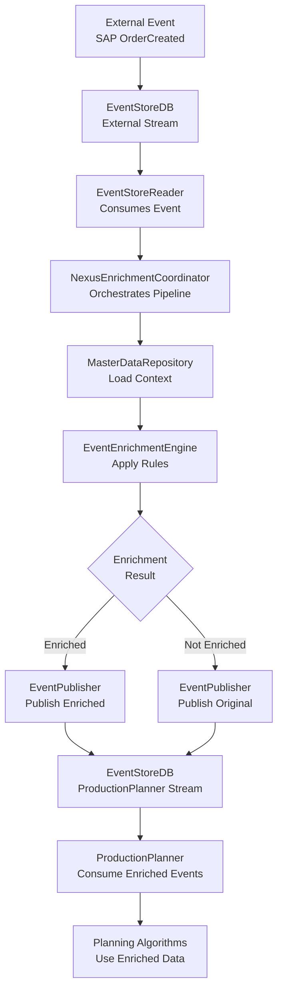
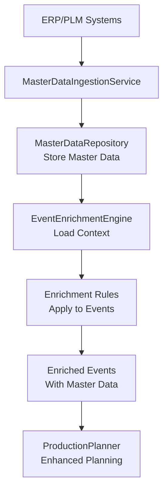
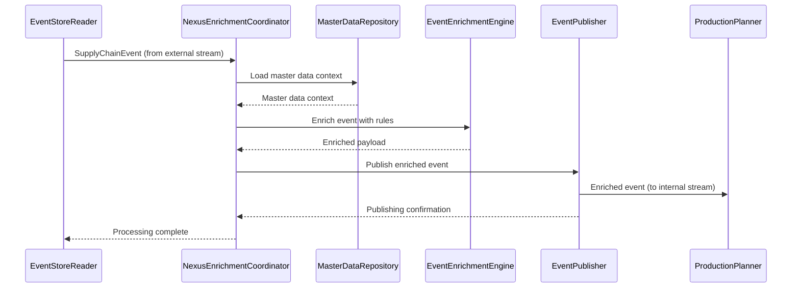
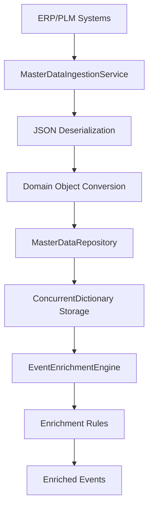

# Medhāvī Supply Chain Event Hub - Project Description Document (PDD)

**Product**: Medhāvī Nexus  
**Version**: 1.0  
**Date**: September 2025  
**Author**: Medhāvī Development Team  
**Status**: Draft - Architecture Definition Phase

---

## Table of Contents

1. [Introduction](#1-introduction)
   - 1.1 [Objectives](#11-objectives)
     - [Stakeholder Perspective](#stakeholder-perspective)
   - 1.2 [PDD Structure](#12-pdd-structure)

2. [Expectations](#2-expectations)
   - 2.1 [Results](#21-results)
   - 2.2 [In Scope](#22-in-scope)
     - [Integration](#integration)
       - [Real-Time Intelligence & Analytics](#real-time-intelligence--analytics)
       - [AI/ML-Powered Features](#aiml-powered-features)
       - [Advanced Visualization](#advanced-visualization)
       - [Autonomous Operations](#autonomous-operations)
       - [Sustainability & Circular Economy](#sustainability--circular-economy)
       - [Augmented Intelligence & Human-Centric Design](#augmented-intelligence--human-centric-design)
       - [Advanced Analytics & Intelligence](#advanced-analytics--intelligence)
   - 2.3 [Performance/Usability](#23-performanceusability)
   - 2.4 [Technology](#24-technology)

3. [Business Goals](#3-business-goals)
   - 3.1 [Goal 1: Real-time Supply Chain Visibility](#31-goal-1-real-time-supply-chain-visibility)
   - 3.2 [Goal 2: Intelligent Event Processing](#32-goal-2-intelligent-event-processing)
   - 3.3 [Goal 3: Cross-System Integration](#33-goal-3-cross-system-integration)

4. [Integration](#4-integration)
   - 4.1 [Overview](#41-overview)
     - 4.1.1 [Data Flow](#411-data-flow)
     - 4.1.2 [Processing Flow](#412-processing-flow)
     - 4.1.3 [KPI Matrix](#413-kpi-matrix)
   - 4.2 [Event Ingestion](#42-event-ingestion)
     - 4.2.1 [Overview](#421-overview)
     - 4.2.2 [Inputs, Process and Outputs](#422-inputs-process-and-outputs)
     - 4.2.3 [Knowledge](#423-knowledge)
     - 4.2.4 [Graphical User Interface](#424-graphical-user-interface)
     - 4.2.5 [Use Cases](#425-use-cases)
   - 4.3 [Master Data Enrichment](#43-master-data-enrichment)
     - 4.3.1 [Description](#431-description)
     - 4.3.2 [Inputs, Process and Outputs](#432-inputs-process-and-outputs)
     - 4.3.3 [Graphical User Interface](#433-graphical-user-interface)
     - 4.3.4 [Use Cases](#434-use-cases)
   - 4.4 [Event Routing Decision](#44-event-routing-decision)
     - 4.4.1 [Description](#441-description)
     - 4.4.2 [Inputs, Process and Outputs](#442-inputs-process-and-outputs)
     - 4.4.3 [Knowledge](#443-knowledge)
     - 4.4.4 [Graphical User Interface](#444-graphical-user-interface)
     - 4.4.5 [Use Cases](#445-use-cases)
   - 4.5 [Real-time Monitoring](#45-real-time-monitoring)
     - 4.5.1 [Description and Relevancy](#451-description-and-relevancy)
     - 4.5.2 [Inputs, Process and Outputs](#452-inputs-process-and-outputs)
     - 4.5.3 [Knowledge](#453-knowledge)
     - 4.5.4 [Use Cases](#454-use-cases)

5. [AI-Powered Event Processing & Digital Twin](#5-ai-powered-event-processing--digital-twin)
   - 5.1 [Real-Time Event Correlation Engine](#51-real-time-event-correlation-engine)
   - 5.2 [Digital Twin Synchronization](#52-digital-twin-synchronization)
   - 5.3 [Predictive Event Processing](#53-predictive-event-processing)
   - 5.4 [Event Storm Detection](#54-event-storm-detection)
   - 5.5 [Temporal Event Analysis](#55-temporal-event-analysis)
   - 5.6 [Event Quality Scoring](#56-event-quality-scoring)

6. [GenAI-Enhanced Master Data Intelligence](#6-genai-enhanced-master-data-intelligence)
   - 6.1 [Autonomous Data Enrichment](#61-autonomous-data-enrichment)
   - 6.2 [Master Data Quality Prediction](#62-master-data-quality-prediction)
   - 6.3 [Cross-Domain Data Correlation](#63-cross-domain-data-correlation)
   - 6.4 [Master Data Evolution Tracking](#64-master-data-evolution-tracking)
   - 6.5 [Semantic Data Understanding](#65-semantic-data-understanding)
   - 6.6 [Master Data Anomaly Detection](#66-master-data-anomaly-detection)

7. [Immersive Real-Time Supply Chain Visibility](#7-immersive-real-time-supply-chain-visibility)
   - 7.1 [3D Digital Twin Visualization](#71-3d-digital-twin-visualization)
   - 7.2 [Real-Time KPI Forecasting](#72-real-time-kpi-forecasting)
   - 7.3 [Supply Chain Heat Maps](#73-supply-chain-heat-maps)
   - 7.4 [Event Stream Analytics](#74-event-stream-analytics)
   - 7.5 [Predictive Performance Dashboards](#75-predictive-performance-dashboards)
   - 7.6 [Collaborative AR Workspaces](#76-collaborative-ar-workspaces)

8. [Autonomous Orchestration & Self-Healing](#8-autonomous-orchestration--self-healing)
   - 8.1 [Self-Healing Workflows](#81-self-healing-workflows)
   - 8.2 [Predictive SLA Management](#82-predictive-sla-management)
   - 8.3 [Autonomous Alert Routing](#83-autonomous-alert-routing)
   - 8.4 [Dynamic Workflow Optimization](#84-dynamic-workflow-optimization)
   - 8.5 [Autonomous Capacity Balancing](#85-autonomous-capacity-balancing)
   - 8.6 [Predictive Maintenance Orchestration](#86-predictive-maintenance-orchestration)

9. [Advanced AI/ML Analytics & Intelligence](#9-advanced-aiml-analytics--intelligence)
   - 9.1 [Transformer-Based Forecasting](#91-transformer-based-forecasting)
   - 9.2 [Causal AI Root Cause Analysis](#92-causal-ai-root-cause-analysis)
   - 9.3 [Generative Scenario Planning](#93-generative-scenario-planning)
   - 9.4 [Federated Learning](#94-federated-learning)
   - 9.5 [Edge AI Analytics](#95-edge-ai-analytics)
   - 9.6 [Quantum-Ready Optimization](#96-quantum-ready-optimization)

10. [Industry 4.0 Integration & Smart Manufacturing](#10-industry-40-integration--smart-manufacturing)
    - 10.1 [Smart Factory Orchestration](#101-smart-factory-orchestration)
    - 10.2 [Digital Thread Management](#102-digital-thread-management)
    - 10.3 [Predictive Equipment Analytics](#103-predictive-equipment-analytics)
    - 10.4 [Quality 4.0 Automation](#104-quality-40-automation)
    - 10.5 [Energy Optimization](#105-energy-optimization)
    - 10.6 [Labor Productivity Intelligence](#106-labor-productivity-intelligence)

11. [Sustainability & Circular Economy Intelligence](#11-sustainability--circular-economy-intelligence)
    - 11.1 [Carbon Footprint Tracking](#111-carbon-footprint-tracking)
    - 11.2 [Sustainable Supplier Scoring](#112-sustainable-supplier-scoring)
    - 11.3 [Circularity Planning](#113-circularity-planning)
    - 11.4 [Green Route Optimization](#114-green-route-optimization)
    - 11.5 [Waste Reduction Analytics](#115-waste-reduction-analytics)
    - 11.6 [Regulatory Compliance AI](#116-regulatory-compliance-ai)

12. [Validation & Quality Assurance](#12-validation--quality-assurance)
    - 12.1 [Validation Approach](#121-validation-approach)
    - 12.2 [Development Best Practices](#122-development-best-practices)

13. [Additional Capabilities](#13-additional-capabilities)
    - 13.1 [System Health Monitoring](#131-system-health-monitoring)
    - 13.2 [Audit Logging](#132-audit-logging)

14. [Appendix A: Technical Architecture](#14-appendix-a-technical-architecture)
    - 14.1 [System Components](#141-system-components)
    - 14.2 [Data Flow Architecture](#142-data-flow-architecture)
    - 14.3 [Scalability Analysis](#143-scalability-analysis)
    - 14.4 [Integration & Communication Patterns](#144-integration--communication-patterns)

15. [Appendix B: Terminology](#15-appendix-b-terminology)

---
## 1. Introduction

### 1.1 Objectives

The main aim of this Project Description Document (PDD) is to describe the Medhāvī Supply Chain Event Hub (Nexus) system that will serve as the intelligent control tower for supply chain operations. This document translates our architectural vision into a technical implementation plan.

#### Stakeholder Perspective
Medhāvī Nexus provides a unified, real-time view of the supply chain. Stakeholders gain early warnings of delays or quality issues through predictive alerts and digital twins, enabling proactive decisions. Autonomous features reduce downtime and operational risk. Overall, Nexus delivers faster, more reliable supply chain execution and helps meet KPIs for cost, quality, and sustainability. Nexus is implemented on a modern event-sourcing foundation where all state changes are stored in EventStoreDB streams (append-only, ordered). 

The Medhāvī Nexus will:
- Consume normalized events from Medhavi.Integrator integration layer
- Process events through persistent actors with event sourcing
- Enrich events with master data for downstream planning systems
- Provide real-time visibility and intelligent orchestration
- Enable seamless integration between supply chain bounded contexts
- Support AI/ML-driven optimization and decision-making
- Serve as the control tower for end-to-end supply chain visibility


### 1.2 PDD Structure

This PDD is organized around the core planning decisions and architectural components:

**Expectations**: Essential properties and requirements for the final solution
**Business Goals**: Measurable objectives that the system should achieve
**Scope Overview**: Functional architecture and event processing flows
**Planning Decisions**: Detailed specifications for each decision point
**Other Functionality**: Supporting capabilities and infrastructure
**Technical Architecture**: System design and scalability considerations


## 2. Expectations

### 2.1 Results

The Medhāvī Nexus should deliver:
- Sub-200ms event processing latency for 99th percentile
- 99.9% system availability with <4 hours annual downtime
- Zero data loss with guaranteed event persistence
- Real-time visibility across all supply chain events
- Seamless integration with existing ERP and WMS systems

### 2.2 In Scope

#### Integration
- **Multi-Source Data Ingestion**: ERP, WMS, MES, IoT, third-party APIs, unstructured data (emails/documents via GenAI parsing) (#GenAI).
- **Event Normalization**: Schema evolution, data transformation, RAG (Retrieval-Augmented Generation) for legacy document ingestion (#GenAI).
- **Real-Time Streaming**: Sub-100 ms event processing, 5G-enabled ultra-low-latency ingestion.
- **Data Quality Assurance**: Automated validation, cleansing, LLM-based anomaly inference (#GenAI, #PredictiveQuality).
- **Master Data Synchronization**: Cross-system data harmonization
- **IoT Sensor Integration**: Edge/IoT data collection from equipment, environment, assets; support for edge AI nodes.
- **API Orchestration**: REST, GraphQL, Webhooks, and GenAI-powered conversational APIs for ad-hoc queries (#GenAI).
- **Event Deduplication**: Two-tier dedup (LRU cache + persistence) for high-throughput messaging.

##### Real-Time Intelligence & Analytics
- **Event Correlation Engine**: AI-powered pattern recognition across events
- **Predictive Alerting**: ML-based anomaly detection and early warning of disruptions (#PredictiveQuality)
- **Digital Twin Management**: Live, multi-layer digital twin of the supply chain (network, inventory, processes)
- **Automated Exception Management**: Smart routing, escalation and automated resolution workflows
- **Cross-System Orchestration**: AI-coordinated API workflows and autonomous actions (#GenAI, #DemandSensing)
- **Real-Time KPI Calculation**: Streaming analytics with sub-second metric updates
- **Multi-Agent Orchestration**: Coordinated AI agents handle complex tasks (e.g. autonomous procurement and fulfillment agents) (#GenAI)

##### AI/ML-Powered Features
- **GenAI Scenario Planning**: Natural language "what-if" analysis with LLMs (#GenAI)
- **Autonomous Optimization**: Self-tuning, multi-objective optimization algorithms (cost, service, carbon) with human oversight
- **Predictive Maintenance**: Equipment failure prediction using IoT data
- **Quality Control Intelligence**: AI-based defect prediction and prevention (including vision analytics) (#PredictiveQuality)
- **Supplier Performance Prediction**: Forecast supplier reliability, quality, and risk
- **Carbon Optimization**: Real-time emissions tracking and reduction
- **ESG Scorecards**: Integrated supplier ESG ratings and risk scoring for decision support (#Sustainability)

##### Advanced Visualization
- **3D Digital Twin Visualization**: AR/VR-enhanced supply chain views with drill-down
- **Immersive Control Room**: Spatial dashboards, heat maps for supply chain health
- **Augmented Reality Mobile**: AR overlays for factory floors (inventory levels, quality)
- **Natural Language Interfaces**:  Voice and visual query support (e.g. "Show all delayed orders by aisle" via voice) (#GenAI)

##### Autonomous Operations
- **Self-Healing Workflows**: Automated disruption responses (reroute shipments, reschedule production)
- **Intelligent Escalation**: Context-aware issue routing to teams or AI bots
- **Predictive Replanning**: AI-driven contingency plans for supply/demand shocks
- **Autonomous Decision Making**: ML agents execute high-confidence operational tasks (under human oversight)
- **Agentic AI Workflows**: Multi-agent GenAI systems coordinate end-to-end actions (e.g. auto-procurement contracts) (#GenAI)

##### Sustainability & Circular Economy
- **Scope 1–3 Emissions Tracking**: Full carbon footprint across operations and suppliers.
- **Recycled Content & Circularity**: Material re-use planning; LCA-driven design alternatives (#Sustainability).
- **Packaging Optimization**: AI-suggested eco-packaging designs.
- **Green Route Planning**: Carbon-aware transportation (green lanes, modal shifts).
- **Water & Biodiversity Metrics**: Supplier-level water usage and habitat impact; supports TNFD/ESRS reporting (#Sustainability)
- **Waste Reduction Intelligence**: Predictive waste generation models to minimize scrap.

##### Augmented Intelligence & Human-Centric Design
- **Human-in-the-Loop AI**: AI provides recommendations; humans retain final authority.
- **GenAI Assistants**: Conversational AI copilots for planners and buyers (#GenAI).
- **Low-Code Workflow Builder**: Custom process design by business users.
- **Voice/NLP Control**: Natural language supply chain commands (#GenAI).
- **Gesture-Based/AR Interfaces**: Hands-free data capture and control on the shop floor.
- **Adaptive Learning UI**: Interface that personalizes to user behavior.

##### Advanced Analytics & Intelligence
- **Causal AI Analysis**: Explainable root-cause analytics (why did demand spike or supply fail).
- **Predictive Scenario Planning**: LLM-driven multi-variant simulations for strategy.
- **Benchmarking Intelligence**: Peer and industry performance comparisons.
- **Real-Time Risk Command Center**: AI-scores supply-chain risks (geo-political, market) for prioritization.
- **Predictive ROI Modeling**: Forecast financial impacts of decisions.


### 2.3 Performance/Usability

**Latency Requirements**
- Event processing: <100ms average, <200ms 99th percentile
- Digital Twin updates: <50ms synchronization latency
- KPI calculations: <100ms for real-time metrics
- AI inference: <200ms for prediction requests
- Alert generation: <500ms from event to alert
- API response times: <100ms for queries, <2s for complex operations
- System startup: <30 seconds

**Throughput Requirements**
- Event processing: 10,000+ events/second
- Pattern recognition: 1,000+ patterns/second
- Digital Twin updates: 100+ state updates/second
- KPI calculations: 50+ metric updates/second
- AI inferences: 100+ predictions/second

**Scalability Requirements**
- Horizontal scaling: Support for multiple Nexus instances
- State management: Distributed digital twin state
- Model serving: Scalable AI/ML model inference
- Event streaming: High-throughput event processing
- Memory usage: <2GB under normal load

**User Experience**
- Intuitive web-based monitoring interface
- Real-time dashboards with WebSocket/SignalR updates
- AR/VR-enhanced visualization capabilities

### 2.4 Technology

- **Runtime**: .NET 10.0, F# primary language
- **Event Processing**: Akka.NET with persistent actors
- **Event Storage**: EventStoreDB
- **Web Framework**: ASP.NET Core
- **UI Framework**: Avalonia.UI
- **Real-time**: SignalR for WebSocket communication
- **Deployment**: Docker containers with Kubernetes orchestration

## 3. Business Goals

### 3.1 Goal 1: Real-time Supply Chain Visibility

**Definition**: Provide immediate visibility into supply chain events and status across all systems and processes.

**Motivation**: Traditional supply chain systems suffer from data silos and delayed information flow. Real-time visibility enables faster decision-making and problem resolution.

**Current State**: Manual data collection and reporting with 24-48 hour delays
**Target State**: Sub-second event visibility with automated alerting
**Success Metric**: 100% event visibility within 5 seconds of occurrence. End-to-End Visibility: Live tracking from raw materials to customer delivery.

**Technical Success Metrics**
- Event processing performance: <100ms latency, 10K+ events/second
- Digital twin synchronization: <50ms update latency
- System availability: 99.5% uptime for Nexus services
- Alert accuracy: 95% true positive rate for anomaly detection


### 3.2 Goal 2: Intelligent Event Processing

**Definition**: Automatically process and correlate supply chain events to identify patterns, anomalies, and optimization opportunities.

**Motivation**: Manual event processing is error-prone and slow. Intelligent processing enables proactive supply chain management.

**Current State**: Reactive, manual event handling
**Target State**: 
 - Predictive Intelligence: AI-powered early warnings and insights.
 - Risk Command Center: Centralized risk monitoring and alerts.
**Success Metric**: 95% of events processed without manual intervention

### 3.3 Goal 3: Cross-System Integration

**Definition**: Enable seamless data flow and process integration between disparate supply chain systems.

**Motivation**: System integration is complex and costly. Standardized event-driven integration reduces complexity and maintenance costs.

**Current State**: Point-to-point integrations with custom code.
**Target State**: Event-driven integration with standardized schemas. Autonomous Orchestration: Self-healing workflows to maintain flow.
**Success Metric**: New system integration completed in <1 week.

**Integration Architecture:**
- Event-driven integration with EventStoreDB as primary event persistence and streaming
- IoT platforms for real-time sensor data integration
- ERP systems for master data and transaction integration
- MES systems for production execution data integration
- External APIs for third-party data source integration
- API orchestration with REST, GraphQL, and WebSocket support

## 4. Integration

### 4.1 Overview

#### 4.1.1 Data Flow
```
┌─────────────────┐    ┌─────────────────┐    ┌─────────────────┐    ┌─────────────────┐
│  Event Sources  │───▶│Medhavi.Integrator│──▶│   Medhāvī      │───▶│  EventStoreDB   │
│  (SAP, WMS, IoT)│    │ (Integration)   │    │   Nexus         │    │                 │
└─────────────────┘    └─────────────────┘    └─────────────────┘    └─────────────────┘
                                                                             │
                                                                             ▼
                                                                    ┌─────────────────┐
                                                                    │  Real-time      │
                                                                    │  Dashboards     │
                                                                    └─────────────────┘
```


| Decision               | Description                            | Automation Level | Frequency  |
| ---------------------- | -------------------------------------- | ---------------- | ---------- |
| Event Ingestion        | Accept and validate incoming events    | Fully Automated  | Continuous |
| Master Data Enrichment | Add contextual data to events          | Semi-Automated   | Per Event  |
| Event Routing          | Route events to appropriate processors | Fully Automated  | Per Event  |
| Real-time Monitoring   | Monitor system health and performance  | Fully Automated  | Continuous |

#### 4.1.2 Processing Flow

1. **External Integration**: Medhavi.Integrator connects to SAP, WMS, IoT sensors
2. **Event Normalization**: Medhavi.Integrator transforms and standardizes external data
3. **Event Publishing**: Medhavi.Integrator publishes normalized events to EventStoreDB
4. **Event Ingestion**: Nexus consumes events from EventStoreDB via EventStoreReader
5. **Event Processing**: Nexus processes events through Akka.NET persistent actors
6. **Master Data Enrichment**: Nexus enriches events with planning-relevant master data
7. **Event Distribution**: Nexus publishes enriched events for ProductionPlanner consumption
8. **Real-time Updates**: Nexus provides WebSocket updates to UI clients

#### 4.1.3 KPI Matrix

1. **Event Processing Latency**: Time from event receipt to processing completion
2. **Event Success Rate**: Percentage of events processed without errors
3. **System Availability**: Percentage of time system is operational
4. **Data Accuracy**: Percentage of events with correct enrichment

### 4.2 Event Ingestion

#### 4.2.1 Overview

The event ingestion decision determines how external events are accepted, validated, and prepared for processing. This is the primary entry point for all supply chain data.

#### 4.2.2 Inputs, Process and Outputs

**Inputs:**
- Raw events from external systems (JSON/XML format)
- Event schemas and validation rules
- System configuration and routing rules

**Process:**
1. Receive event via HTTP/WebSocket
2. Validate event schema and structure
3. Enrich with metadata (timestamps, correlation IDs)
4. Route to appropriate processing queue

**Outputs:**
- Validated and enriched events
- Processing acknowledgments
- Error notifications for invalid events

#### 4.2.3 Knowledge
**Preconditions:**
- Event must conform to defined schema
- Source system must be authorized
- System must have available processing capacity

**Constraints:**
- Event size limit: 10MB
- Processing rate limit: 1000 events/second
- Schema validation: Strict mode

#### 4.2.4 Graphical User Interface
- Event monitoring dashboard
- Real-time event throughput graphs
- Error event queue viewer
- Event replay controls

#### 4.2.5 Use Cases
1. **Normal Event Processing**: System accepts valid event and processes immediately
2. **Invalid Event Handling**: System rejects malformed event with detailed error message
3. **High Volume Processing**: System handles traffic spikes with queuing
4. **Event Replay**: Administrator can replay failed events

### 4.3 Master Data Enrichment

#### 4.3.1 Description
Master data enrichment adds contextual information to events, enabling intelligent processing and cross-system correlation. The Nexus Event Enrichment System provides a comprehensive framework for enriching events with planning-relevant master data before publishing to downstream systems like ProductionPlanner.

#### 4.3.2 Technical Implementation

##### Core Components
- **MasterDataRepository.fs**: In-memory repository for master data storage with thread-safe concurrent collections
- **EventEnrichmentEngine.fs**: Rule-based enrichment engine with configurable enrichment rules
- **EventPublisher.fs**: Publishing system for enriched events to ProductionPlanner streams
- **MasterDataIngestionService.fs**: Service for loading master data from external sources
- **NexusEnrichmentCoordinator.fs**: Main orchestration coordinator with retry logic and monitoring

##### Enrichment Pipeline
```fsharp
// Complete enrichment flow
let enrichEvent (event: SupplyChainEvent) = async {
    // 1. Load master data context
    let! context = loadEnrichmentContext event

    // 2. Apply enrichment rules
    let! result = enrichmentEngine.EnrichEventAsync(event)

    // 3. Publish enriched event
    match result with
    | Enriched enrichedPayload ->
        let enrichedEvent = { event with Payload = enrichedPayload }
        let! publishResult = publisher.PublishToProductionPlannerAsync(enrichedEvent)
        return Success enrichedEvent
    | _ -> return EnrichmentSkipped "No enrichment applied"
}
```

#### 4.3.3 Inputs, Process and Outputs

**Inputs:**
- Raw events from EventStoreDB external streams
- Master data from ERP/PLM systems (products, BOMs, routings, resources)
- Business rules for enrichment logic
- Configuration for enrichment rules and retry policies

**Process:**
1. **Event Reception**: Events consumed from EventStoreDB via EventStoreReader
2. **Context Loading**: Master data loaded for enrichment (products, routings, resources)
3. **Rule Application**: Configurable enrichment rules applied based on event type
4. **Payload Enrichment**: Event payload enhanced with planning-relevant data
5. **Validation**: Enriched event validated before publishing
6. **Publishing**: Enriched events published to ProductionPlanner streams
7. **Monitoring**: Enrichment metrics collected and monitored

**Outputs:**
- Enriched events with full planning context
- Enrichment success/failure metrics
- Master data quality reports
- Processing latency and throughput statistics

#### 4.3.4 Enrichment Rules Engine

##### Rule-Based Enrichment
```fsharp
type EnrichmentRule = {
    Name: string
    AppliesTo: string list  // Event types this rule applies to
    EnrichFunction: EnrichmentContext -> Task<EnrichmentResult>
}

// Example: Order Enrichment Rule
let createOrderEnrichmentRule () : EnrichmentRule = {
    Name = "Order Enrichment"
    AppliesTo = ["OrderCreated"; "OrderUpdated"]
    EnrichFunction = fun context ->
        task {
            // Enrich order items with product master data
            let enrichedItems = context.OriginalEvent
                                |> parseOrderItems
                                |> List.map (enrichWithProductData context.ProductData)

            // Add enrichment metadata
            let enrichedOrder = {
                Items = enrichedItems
                EnrichmentMetadata = {
                    EnrichedAt = DateTimeOffset.UtcNow
                    ProductsEnriched = enrichedItems.Length
                    RoutingDataAvailable = false
                    ResourceCapacityAvailable = false
                }
            }

            return Enriched (Json.serialize enrichedOrder)
        }
}
```

##### Production Order Enrichment
```fsharp
let createProductionOrderEnrichmentRule () : EnrichmentRule = {
    Name = "Production Order Enrichment"
    AppliesTo = ["ProductionOrderCreated"; "WorkOrderCreated"]
    EnrichFunction = fun context ->
        task {
            // Add routing operations
            let routingData = context.RoutingData
                                |> Map.tryFind context.OriginalEvent.AggregateId

            // Add resource capacity information
            let capacityData = context.ResourceCapacityData
                                |> Map.tryFind (getResourceId context.OriginalEvent)

            let enrichedOrder = {
                RoutingData = routingData
                ResourceCapacityData = capacityData
                EnrichmentMetadata = {
                    EnrichedAt = DateTimeOffset.UtcNow
                    RoutingEnriched = routingData.IsSome
                    CapacityEnriched = capacityData.IsSome
                    ProductDataAvailable = false
                }
            }

            return Enriched (Json.serialize enrichedOrder)
        }
}
```

#### 4.3.5 Master Data Repository

##### Interface Definition
```fsharp
type IMasterDataRepository =
    // Product Master Data
    abstract member GetProductAsync: ProductId -> Task<Nexus.Product option>
    abstract member GetProductWithBOMAsync: ProductId -> Task<Nexus.ProductWithBOM option>
    abstract member StoreProductAsync: Nexus.Product -> Task<unit>

    // Routing Master Data
    abstract member GetRoutingAsync: string -> Task<ProductionPlanning.Routing option>
    abstract member StoreRoutingAsync: ProductionPlanning.Routing -> Task<unit>

    // Resource Capacity Master Data
    abstract member GetResourceCapacityAsync: string -> Task<Nexus.ResourceCapacityPeriod list>
    abstract member StoreResourceCapacityAsync: Nexus.ResourceCapacityPeriod -> Task<unit>
```

##### In-Memory Implementation
- **ConcurrentDictionary**: Thread-safe storage for master data
- **Lazy Loading**: Master data loaded on-demand for performance
- **Comprehensive Logging**: Full audit trail for data operations
- **Type Safety**: Strong typing with domain-specific types

#### 4.3.6 Enrichment Examples

##### Before Enrichment (Original Event):
```json
{
  "eventId": "order-123",
  "eventType": "OrderCreated",
  "payload": {
    "orderId": "ORD-001",
    "items": [
      {
        "productId": "PROD-456",
        "quantity": 100
      }
    ]
  }
}
```

##### After Enrichment (Enriched Event):
```json
{
  "eventId": "order-123",
  "eventType": "OrderCreated",
  "payload": {
    "orderId": "ORD-001",
    "items": [
      {
        "productId": "PROD-456",
        "productName": "Widget Assembly",
        "productGroup": "Finished Goods",
        "quantity": 100,
        "pieceWeight": 2.5,
        "routing": {
          "id": "ROUT-789",
          "operations": [
            {
              "sequence": 10,
              "workCenter": "WC-001",
              "setupTime": 30,
              "runTime": 45
            }
          ]
        },
        "resourceCapacity": {
          "resourceId": "WC-001",
          "capacityPeriods": [
            {
              "startDate": "2025-01-01",
              "endDate": "2025-12-31",
              "availableCapacity": 480
            }
          ]
        }
      }
    ],
    "enrichmentMetadata": {
      "enrichedAt": "2025-09-15T03:43:00Z",
      "productsEnriched": 1,
      "routingDataAvailable": true,
      "resourceCapacityAvailable": true
    }
  },
  "metadata": {
    "enrichedBy": "NexusEnrichmentCoordinator",
    "enrichmentTimestamp": "2025-09-15T03:43:00Z",
    "publishedTo": "ProductionPlanner"
  }
}
```

#### 4.3.7 Knowledge

**Preconditions:**
- Master data must be loaded and available in repository
- Event schema must be compatible with enrichment rules
- System must have sufficient memory for master data caching

**Business Rules:**
- **Product Enrichment**: Add full product hierarchy, specifications, and BOM data
- **Routing Enrichment**: Include operation sequences, work centers, and timing data
- **Resource Enrichment**: Add capacity periods, efficiency factors, and availability
- **Customer Enrichment**: Include customer segments, preferences, and historical data
- **Location Enrichment**: Add geographic context, transportation zones, and costs

**Constraints:**
- **Memory Limits**: Master data cache size limited to available system memory
- **Processing Timeouts**: Enrichment operations must complete within 30 seconds
- **Data Freshness**: Master data refreshed every 15 minutes from source systems
- **Fallback Behavior**: Events published without enrichment if master data unavailable

#### 4.3.8 Graphical User Interface

##### Master Data Management Dashboard
- **Data Loading Status**: Real-time view of master data ingestion progress
- **Data Quality Metrics**: Completeness, accuracy, and freshness indicators
- **Enrichment Rule Configuration**: Visual rule builder with drag-and-drop interface
- **Performance Monitoring**: Enrichment throughput and latency graphs

##### Enrichment Monitoring Interface
- **Real-time Enrichment Metrics**: Success rates, processing times, error counts
- **Event Flow Visualization**: Graphical representation of enrichment pipeline
- **Rule Performance Analysis**: Which rules are most/least effective
- **Data Quality Reports**: Automated reports on enrichment completeness

##### Alert Management
- **Enrichment Failures**: Alerts for failed enrichment operations
- **Data Quality Issues**: Notifications for missing or stale master data
- **Performance Degradation**: Warnings for slow enrichment processing
- **Capacity Issues**: Alerts for high memory usage or processing backlogs

#### 4.3.9 Use Cases

1. **Standard Enrichment**: Event enriched with all available master data
   - **Trigger**: OrderCreated event received
   - **Process**: Product, routing, and capacity data added
   - **Result**: Fully enriched event published to ProductionPlanner

2. **Partial Enrichment**: Event enriched with available data, gaps logged
   - **Trigger**: ProductionOrderCreated event with missing routing data
   - **Process**: Available product and capacity data added, routing gap logged
   - **Result**: Partially enriched event published with quality warnings

3. **Enrichment Failure**: Event processed without enrichment, alert generated
   - **Trigger**: Master data repository unavailable
   - **Process**: Event published in original form, system alert generated
   - **Result**: Original event forwarded, incident ticket created

4. **Batch Enrichment**: Multiple events processed efficiently
   - **Trigger**: Bulk order import from ERP system
   - **Process**: Events processed in parallel with shared master data context
   - **Result**: All events enriched and published with consolidated metrics

5. **Real-time Enrichment**: Events enriched with latest master data
   - **Trigger**: Continuous event stream from manufacturing floor
   - **Process**: Events enriched with real-time capacity and routing updates
   - **Result**: ProductionPlanner receives current operational context

#### 4.3.10 Automation Level

**Fully Automated Components:**
- Event reception and routing to enrichment engine
- Master data lookup and caching
- Rule application and payload enrichment
- Publishing to downstream systems
- Metrics collection and health monitoring

**Semi-Automated Components:**
- Master data ingestion from external systems (scheduled)
- Enrichment rule configuration (admin interface)
- Alert response and incident management

**Manual Components:**
- Master data quality review and correction
- Enrichment rule development and testing
- Performance tuning and capacity planning

### 4.4 Event Routing Decision

#### 4.4.1 Description
Event routing determines how processed events are distributed to internal and external consumers.

#### 4.4.2 Inputs, Process and Outputs
**Inputs:**
- Processed events from enrichment
- Routing rules and subscriber lists
- System capacity and performance metrics

**Process:**
1. Evaluate routing rules against event content
2. Determine appropriate destinations
3. Apply filtering and transformation rules
4. Distribute to subscribers

**Outputs:**
- Routed events to appropriate destinations
- Routing success/failure metrics
- Subscriber health status

#### 4.4.3 Knowledge
**Routing Rules:**
- Event type-based routing
- Content-based filtering
- Priority-based queuing
- Geographic distribution rules

#### 4.4.4 Graphical User Interface
- Routing rule configuration interface
- Subscriber management dashboard
- Routing performance monitoring
- Message queue viewers

#### 4.4.5 Use Cases
1. **Standard Routing**: Event delivered to all relevant subscribers
2. **Filtered Routing**: Event delivered only to authorized subscribers
3. **Priority Routing**: High-priority events processed first
4. **Failed Routing**: Undeliverable events queued for retry

### 4.5 Real-time Monitoring

#### 4.5.1 Description and Relevancy
Real-time monitoring provides visibility into system health, performance, and event processing status.

#### 4.5.2 Inputs, Process and Outputs
**Inputs:**
- System metrics and logs
- Event processing statistics
- Infrastructure health data

**Process:**
1. Collect metrics from all system components
2. Analyze performance against thresholds
3. Generate alerts for anomalies
4. Update monitoring dashboards

**Outputs:**
- Real-time dashboards and alerts
- Performance reports and analytics
- System health assessments

#### 4.5.3 Knowledge
**Monitoring Rules:**
- Latency thresholds for different operations
- Error rate limits and escalation rules
- Capacity utilization warnings
- Data quality metrics

#### Graphical User Interface
- Real-time dashboard with KPIs
- Alert management interface
- Performance trend charts
- System topology visualization

#### 4.5.4 Use Cases
1. **Normal Monitoring**: System operating within parameters
2. **Performance Alert**: System generates alert for high latency
3. **Error Detection**: System identifies and reports processing errors
4. **Capacity Planning**: System provides utilization trends


## 5. AI-Powered Event Processing & Digital Twin

### 5.1 Real-Time Event Correlation Engine

#### 5.1.1 Description
AI-powered pattern recognition across 1000+ event types. Real-time event correlation and anomaly detection with predictive alerting for supply chain disruptions. Automated exception management and resolution.

#### 5.1.2 Goals
- AI-powered pattern recognition across 1000+ event types
- Real-time event correlation and anomaly detection
- Predictive alerting for supply chain disruptions
- Automated exception management and resolution

#### 5.1.3 Technical Implementation
- Event correlation engine with ML-based pattern recognition
- Pattern detection across event streams
- Anomaly detection with 95% accuracy target
- Real-time alert generation and routing
- Automated exception resolution workflows

#### 5.1.4 Integration Points
- Consumes events from EventStoreDB external streams
- Publishes correlation results to internal streams
- Integrates with alerting and notification systems
- Connects to digital twin for impact assessment

#### 5.1.5 Success Criteria
- Event correlation identifying patterns in 90% of events
- Anomaly detection with 95% accuracy
- Real-time alerting for critical issues
- Automated exception management operational

#### 5.1.6 Telemetry / KPIs
- Pattern recognition latency
- Anomaly detection accuracy
- Alert generation rate
- Exception resolution rate

### 5.2 Digital Twin Synchronization

#### 5.2.1 Description
Live, multi-layer digital twin of supply chain with real-time synchronization with physical operations. 3D visualization with AR/VR capabilities. Predictive simulation and scenario planning.

#### 5.2.2 Goals
- Live, multi-layer digital twin of supply chain
- Real-time synchronization with physical operations
- 3D visualization with AR/VR capabilities
- Predictive simulation and scenario planning

#### 5.2.3 Technical Implementation
- Digital twin state management with <50ms synchronization latency
- Multi-layer representation (network, inventory, processes)
- Real-time state updates from event streams
- 3D visualization engine with AR/VR rendering
- Simulation engine for scenario planning

#### 5.2.4 Integration Points
- Real-time event consumption for state updates
- IoT sensor data integration for physical sync
- AR/VR rendering for immersive visualization
- ProductionPlanning integration for planning scenarios

#### 5.2.5 Success Criteria
- Digital twin synchronized within 100ms (target: <50ms)
- 3D visualization rendering supply chain topology
- Real-time KPI calculations from twin state
- Predictive simulation capabilities operational

#### 5.2.6 Telemetry / KPIs
- Synchronization latency (<50ms target)
- State update throughput (100+ updates/second)
- Visualization rendering performance
- Simulation accuracy
### 5.3 Predictive Event Processing
#### 5.3.1 Description
ML-based event pattern prediction and proactive processing

### 5.4 Event Storm Detection
#### 5.4.1 Description
Automated identification of event cascades and system disruptions

### 5.5 Temporal Event Analysis
#### 5.5.1 Description
AI-driven analysis of event sequences and timing patterns
### 5.6 Event Quality Scoring
#### 5.6.1 Description
ML-based event completeness and accuracy assessment

## 6. GenAI-Enhanced Master Data Intelligence

### 6.1 Autonomous Data Enrichment
#### 6.1.1 Description
AI-powered contextual data addition using knowledge graphs

### 6.2 Master Data Quality Prediction
#### 6.2.1 Description
ML-based data quality assessment and auto-correction

### 6.3 Cross-Domain Data Correlation
#### 6.3.1 Description
AI linking of master data across products, customers, suppliers

### 6.4 Master Data Evolution Tracking
#### 6.4.1 Description
Automated detection of master data changes and impacts

### 6.5 Semantic Data Understanding
#### 6.5.1 Description
Natural language processing for unstructured master data

### 6.6 Master Data Anomaly Detection
#### 6.6.1 Description
AI identification of data inconsistencies and outliers

## 7. Immersive Real-Time Supply Chain Visibility

### 7.1 3D Digital Twin Visualization
#### 7.1.1 Description
AR/VR-enhanced supply chain topology with spatial analytics

### 7.2 Real-Time KPI Forecasting
#### 7.2.1 Description
AI-powered KPI prediction with confidence intervals

### 7.3 Supply Chain Heat Maps
#### 7.3.1 Description
Dynamic bottleneck identification and capacity visualization

### 7.4 Event Stream Analytics
#### 7.4.1 Description
Real-time event velocity, volume, and pattern analysis

### 7.5 Predictive Performance Dashboards
#### 7.5.1 Description
ML-driven performance trend forecasting

### 7.6 Collaborative AR Workspaces
#### 7.6.1 Description
Multi-user AR environments for remote collaboration

## 8. Autonomous Orchestration & Self-Healing

### 8.1 Self-Healing Workflows

#### 8.1.1 Description
Self-healing workflows for disruption response. Intelligent escalation and routing. Predictive replanning for supply/demand shocks. Autonomous decision making under human oversight.

#### 8.1.2 Goals
- Self-healing workflows for disruption response
- Intelligent escalation and routing
- Predictive replanning for supply/demand shocks
- Autonomous decision making under human oversight

#### 8.1.3 Technical Implementation
- Autonomous operations engine for disruption detection
- Self-healing workflow manager
- Automated response plan generation
- Human-in-the-loop oversight mechanisms
- Rollback and audit capabilities

#### 8.1.4 Integration Points
- Event correlation engine for disruption detection
- Digital twin for impact assessment
- External system APIs for automated responses
- ProductionPlanning for replanning coordination

#### 8.1.5 Success Criteria
- Disruption detection with 90% accuracy
- Automated response generation working
- Self-healing workflows operational
- Human oversight integration functional

#### 8.1.6 Telemetry / KPIs
- Disruption detection accuracy (90%+ target)
- Response generation latency
- Self-healing success rate
- Human intervention rate

### 8.2 Predictive SLA Management
#### 8.2.1 Description
ML-based SLA violation prediction and proactive mitigation

### 8.3 Autonomous Alert Routing
#### 8.3.1 Description
Intelligent alert prioritization and stakeholder targeting

### 8.4 Dynamic Workflow Optimization
#### 8.4.1 Description
Real-time workflow path optimization based on current conditions

### 8.5 Autonomous Capacity Balancing
#### 8.5.1 Description
AI-driven resource reallocation across supply chain nodes

### 8.6 Predictive Maintenance Orchestration
#### 8.6.1 Description
Automated maintenance scheduling coordination

## 9. Advanced AI/ML Analytics & Intelligence

### 9.1 Transformer-Based Forecasting

#### 9.1.1 Description
Deep learning demand prediction with 95%+ accuracy. Transformer-based forecasting models for time-series prediction with high accuracy and explainability.

#### 9.1.2 Goals
- Deep learning demand prediction with 95%+ accuracy
- Time-series forecasting with transformer models
- Multi-horizon prediction capabilities
- Explainable forecasting results

#### 9.1.3 Technical Implementation
- Transformer-based forecasting models
- Time-series data preprocessing
- Model training and deployment pipeline
- Real-time inference service
- Forecast accuracy monitoring

#### 9.1.4 Integration Points
- Historical demand data for model training
- Real-time demand signals for prediction
- ProductionPlanning for demand planning
- Dashboard systems for forecast visualization

#### 9.1.5 Success Criteria
- Forecasting accuracy 95%+ for demand prediction
- Real-time inference operational
- Multi-horizon forecasting working
- Model explainability functional

#### 9.1.6 Telemetry / KPIs
- Forecasting accuracy (95%+ target)
- Model inference latency
- Forecast horizon coverage
- Model version performance tracking

### 9.2 Causal AI Root Cause Analysis
#### 9.2.1 Description
Explainable AI for supply chain disruption diagnosis

### 9.3 Generative Scenario Planning
#### 9.3.1 Description
AI-powered "what-if" analysis with natural language interface

### 9.4 Federated Learning
#### 9.4.1 Description
Privacy-preserving ML across distributed supply chain sites

### 9.5 Edge AI Analytics
#### 9.5.1 Description
Real-time intelligence at production sites without data centralization

### 9.6 Quantum-Ready Optimization
#### 9.6.1 Description
Future-proofed algorithms for quantum computing acceleration

## 10. Industry 4.0 Integration & Smart Manufacturing

### 10.1 Smart Factory Orchestration

#### 10.1.1 Description
MES, PLC, and IoT device coordination. Smart factory orchestration enables real-time coordination between manufacturing execution systems, programmable logic controllers, and IoT devices for seamless production operations.

#### 10.1.2 Goals
- MES, PLC, and IoT device coordination
- Real-time production floor integration
- Equipment data collection and analysis
- Automated production workflow orchestration

#### 10.1.3 Technical Implementation
- MES integration for production order management
- PLC connectivity for equipment control
- IoT sensor network integration
- Real-time data collection and processing
- Production workflow orchestration engine

#### 10.1.4 Integration Points
- MES systems for production execution data
- PLC systems for equipment control
- IoT platforms for sensor data
- ProductionPlanning for production orders

#### 10.1.5 Success Criteria
- Real-time MES/PLC/IoT coordination operational
- Equipment data collection working
- Production workflow orchestration functional
- Integration latency <100ms

### 10.2 Digital Thread Management
#### 10.2.1 Description
End-to-end traceability from design to delivery

### 10.3 Predictive Equipment Analytics

#### 10.3.1 Description
Equipment failure prediction using IoT data. Predictive maintenance scheduling optimization. Real-time equipment health monitoring. Automated maintenance work order generation.

#### 10.3.2 Goals
- Equipment failure prediction using IoT data
- Predictive maintenance scheduling optimization
- Real-time equipment health monitoring
- Automated maintenance work order generation

#### 10.3.3 Technical Implementation
- IoT data integration for sensor data collection
- Predictive maintenance models (95% accuracy target)
- Equipment health analysis engine
- Maintenance schedule optimization
- Automated work order generation

#### 10.3.4 Integration Points
- IoT sensor network for real-time data collection
- Equipment master data for health analysis
- Maintenance scheduling system integration
- ProductionPlanning for maintenance coordination

#### 10.3.5 Success Criteria
- Equipment failure prediction with 95% accuracy
- Real-time health monitoring operational
- Automated maintenance scheduling working
- IoT sensor integration functional

#### 10.3.6 Telemetry / KPIs
- Prediction accuracy (95%+ target)
- Health monitoring latency
- Maintenance schedule optimization rate
- IoT data collection throughput

### 10.4 Quality 4.0 Automation
#### 10.4.1 Description
Computer vision-based defect detection and classification

### 10.5 Energy Optimization
#### 10.5.1 Description
AI-driven consumption reduction and renewable integration

### 10.6 Labor Productivity Intelligence
#### 10.6.1 Description
Workforce optimization with skill matching

## 11. Sustainability & Circular Economy Intelligence

### 11.1 Carbon Footprint Tracking
#### 11.1.1 Description
Real-time emissions calculation across entire supply chain

### 11.2 Sustainable Supplier Scoring
#### 11.2.1 Description
ESG-based supplier evaluation and ranking

### 11.3 Circularity Planning
#### 11.3.1 Description
AI-driven scrap reuse and material recovery optimization

### 11.4 Green Route Optimization
#### 11.4.1 Description
Carbon-aware transportation and logistics planning

### 11.5 Waste Reduction Analytics
#### 11.5.1 Description
Predictive waste generation and minimization

### 11.6 Regulatory Compliance AI
#### 11.6.1 Description
Automated compliance monitoring and reporting


## 13. Additional Capabilities

### 13.1 System Health Monitoring

#### 13.1.1 Description
System health monitoring ensures the reliability and availability of the Medhāvī Nexus platform.

#### 13.1.2 Inputs, Process and Outputs
**Inputs:** System metrics, logs, and performance data
**Process:** Automated health checks and alerting
**Outputs:** Health status reports and maintenance notifications

#### 13.1.3 Knowledge
Health check rules and thresholds for all system components.

#### 13.1.4 Graphical User Interface
Health dashboard with component status indicators.

#### 13.1.5 Use Cases
1. System startup health verification
2. Continuous health monitoring
3. Automated recovery procedures

#### 13.1.6 Automation
Fully automated health monitoring with manual intervention capabilities.

### 13.2 Audit Logging

#### 13.2.1 Description
Audit logging provides complete traceability of system activities and changes.

#### 13.2.2 Inputs, Process and Outputs
**Inputs:** System events and user actions
**Process:** Structured logging with retention policies
**Outputs:** Audit reports and compliance documentation

#### 13.2.3 Knowledge
Audit requirements and retention policies.

#### 13.2.4 Graphical User Interface
Audit log viewer with filtering and search capabilities.

#### 13.2.5 Use Cases
1. Security incident investigation
2. Compliance reporting
3. System troubleshooting

#### 13.2.6 Automation
Fully automated logging with configurable retention.

## 14. Appendix A: Technical Architecture

### 14.1 System Components

#### Event Ingestion Layer
- HTTP/WebSocket endpoints for event reception
- Schema validation and transformation
- Event buffering and queuing
- Real-time event correlation engine with AI-powered pattern recognition
- Event quality scoring and anomaly detection

#### Master Data Enrichment Layer
- **MasterDataRepository.fs**: In-memory master data storage with concurrent collections
- **EventEnrichmentEngine.fs**: Rule-based enrichment engine with configurable rules
- **EventPublisher.fs**: Publishing system for enriched events to ProductionPlanner
- **MasterDataIngestionService.fs**: Service for loading master data from external sources
- **NexusEnrichmentCoordinator.fs**: Main orchestration with retry logic and monitoring

##### Enrichment Pipeline Components:
```fsharp
// Core enrichment interfaces
type IMasterDataRepository = // Master data storage operations
type IEventEnrichmentEngine = // Rule-based enrichment logic
type IEventPublisher = // Publishing to downstream systems
type IMasterDataIngestionService = // External data loading
type INexusEnrichmentCoordinator = // Main orchestration
```

##### Enrichment Rules Engine:
```fsharp
type EnrichmentRule = {
    Name: string
    AppliesTo: string list  // Event types this rule applies to
    EnrichFunction: EnrichmentContext -> Task<EnrichmentResult>
}

// Built-in rules for common scenarios
let orderEnrichmentRule = createOrderEnrichmentRule()
let productionOrderEnrichmentRule = createProductionOrderEnrichmentRule()
```

#### Processing Layer
- Akka.NET actor system for event processing with persistent actors
- Event sourcing with EventStoreDB streams (append-only, ordered)
- Business rule engine integration for automated decision-making
- AI/ML pipeline integration for predictive analytics
- Saga patterns for complex workflow orchestration
- **Nexus Enrichment Coordinator**: Orchestrates enrichment pipeline with monitoring

#### Storage Layer
- EventStoreDB for event persistence and CQRS implementation
- Read model projections for optimized query performance
- **Master Data Repository**: In-memory storage with thread-safe concurrent collections
- Time-series databases for KPI and analytics data
- Distributed caching for high-performance data access
- **Master Data Ingestion**: Automated loading from ERP/PLM systems

#### Integration Layer
- REST APIs for external systems with GraphQL support
- WebSocket/SignalR for real-time bidirectional communication
- Message queues (Kafka/EventStore) for async communication
- **Event Publishing System**: Dedicated publishing to ProductionPlanner streams
- API mesh architecture for intelligent orchestration
- Multi-protocol support (MQTT, OPC-UA) for IoT integration

#### AI/ML Layer
- Transformer-based forecasting models with 95%+ accuracy
- Causal AI for explainable root cause analysis
- Generative AI for natural language scenario planning
- Federated learning for distributed model training
- Edge AI capabilities for on-site intelligence
- Bias detection and mitigation frameworks

#### Visualization Layer
- 3D digital twin visualization with AR/VR support
- Real-time KPI dashboards with predictive forecasting
- Spatial analytics and heat maps for bottleneck identification
- Voice-activated natural language interfaces
- Gesture-based and multi-modal interaction systems

### 14.2 Data Flow Architecture

```
External Systems (SAP, WMS, IoT)
        ↓
Medhavi.Integrator (Integration Layer)
        ↓ (EventStoreDB - External Stream)
Medhāvī Nexus (Control Tower)
        ↓
┌─────────────────────────────────────┐
│    NEXUS ENRICHMENT PIPELINE        │
├─────────────────────────────────────┤
│ 1. EventStoreReader                 │
│    → Consumes external events       │
│                                     │
│ 2. NexusEnrichmentCoordinator       │
│    → Orchestrates enrichment        │
│                                     │
│ 3. MasterDataRepository             │
│    → Provides master data context   │
│                                     │
│ 4. EventEnrichmentEngine            │
│    → Applies enrichment rules       │
│                                     │
│ 5. EventPublisher                   │
│    → Publishes to ProductionPlanner │
└─────────────────────────────────────┘
        ↓ (EventStoreDB - Enriched Stream)
ProductionPlanner (APS System)
        ↓
Avalonia UI (User Interface)
```

#### Detailed Enrichment Data Flow:



#### Master Data Flow:



#### Key Data Flow Characteristics:

1. **Event-Driven Pipeline**: All enrichment triggered by incoming events
2. **Master Data Context**: Loaded on-demand for each enrichment operation
3. **Rule-Based Processing**: Configurable rules determine enrichment logic
4. **Fault-Tolerant Publishing**: Original events published if enrichment fails
5. **Real-Time Enrichment**: Sub-second processing with in-memory master data
6. **Observable Pipeline**: Comprehensive metrics and monitoring throughout

### 14.3 Scalability Analysis

**Current Load:** 1000 events/second
**Target Load:** 10,000 events/second
**Scaling Strategy:** Horizontal scaling with Kubernetes
**Performance Baseline:** Sub-200ms processing latency

**Scalability Requirements:**
- **Horizontal Scaling**: Support for multiple Nexus instances
- **State Management**: Distributed digital twin state
- **Model Serving**: Scalable AI/ML model inference
- **Event Streaming**: High-throughput event processing (10,000+ events/second)
- **Pattern Recognition**: 1,000+ patterns/second
- **Digital Twin Updates**: 100+ state updates/second
- **KPI Calculations**: 50+ metric updates/second
- **AI Inferences**: 100+ predictions/second

### 14.4 Integration & Communication Patterns

#### Event-Driven Fabric
All communication is event-based. Medhavi.Integrator writes events into EventStore streams (one stream per aggregate or logical source). Nexus and other modules subscribe to the relevant streams. For example, each Production Planning aggregate might listen for InventoryUpdated or SalesOrderConfirmed events. This decoupling allows teams to work independently on each module's code.

#### CQRS & APIs
The design follows CQRS: command handlers process incoming commands (or events), append events to the store, and read-side projections answer queries. RESTful and GraphQL APIs are exposed for front-end apps or external queries (e.g. a dashboard fetches the current schedule). Webhooks or messaging (Kafka, SignalR) can push critical events out to partners.

#### Bounded Contexts
Nexus, ProductionPlanner, and Integrator each form a distinct bounded context in the DDD sense. Their data models and events are encapsulated. Integration between them happens only through well-defined events and APIs. For instance, a ReplenishmentSuggested event from Nexus would be the trigger for Production Planning to create a PurchaseOrder internally. This clear separation simplifies maintenance and scaling.

#### Real-Time Event Flow
In practice, incoming data is received by an actor or service, normalized, validated, and then appended to the event store. Downstream services (like Nexus) subscribe to these event streams. For example, when Integrator writes InventoryAdjusted into the event store, Nexus can immediately consume it to update KPIs or trigger re-planning.

#### Nexus Event Enrichment Communication Patterns

##### Enrichment Pipeline Communication:


##### Master Data Synchronization:


##### Error Handling & Resilience:
- **Circuit Breaker Pattern**: Protects against master data repository failures
- **Retry Logic**: Configurable retry attempts for transient failures
- **Fallback Publishing**: Original events published if enrichment fails
- **Dead Letter Queues**: Failed events queued for manual review
- **Health Monitoring**: Real-time monitoring of enrichment pipeline health

##### Performance Optimization:
- **Concurrent Processing**: Parallel enrichment of multiple events
- **Lazy Loading**: Master data loaded on-demand to reduce memory usage
- **Caching Strategy**: In-memory caching of frequently accessed master data
- **Batch Operations**: Efficient bulk processing for high-throughput scenarios
- **Async Processing**: Non-blocking operations throughout the pipeline

---

## 15. Appendix B: Terminology

| Term                       | Description                                                                |
| -------------------------- | -------------------------------------------------------------------------- |
| Medhavi.Integrator         | Integration layer that connects to external systems (SAP, WMS, IoT)        |
| Event                      | A structured message representing a business occurrence                    |
| Event Sourcing             | Persistence pattern storing state changes as events                        |
| CQRS                       | Command Query Responsibility Segregation pattern                           |
| Bounded Context            | A boundary within which a domain model is consistent                       |
| Actor                      | Concurrent computation primitive in Akka.NET                               |
| EventStoreDB               | Purpose-built database for event storage                                   |
| Nexus                      | The central control tower component for supply chain orchestration         |
| ProductionPlanner          | Advanced Planning & Scheduling system (separate bounded context)           |
| Master Data                | Reference data shared across bounded contexts                              |
| Control Tower              | Central orchestration and visibility platform                              |
| Event Enrichment           | Process of adding contextual master data to events for enhanced processing |
| MasterDataRepository       | In-memory storage system for master data with thread-safe operations       |
| EventEnrichmentEngine      | Rule-based engine that applies enrichment logic to events                  |
| EnrichmentRule             | Configurable rule defining how to enrich specific event types              |
| EnrichmentContext          | Runtime context containing master data for enrichment operations           |
| EnrichmentCoordinator      | Main orchestrator managing the complete enrichment pipeline                |
| EnrichmentPipeline         | End-to-end process from event reception to enriched event publishing       |
| EnrichmentResult           | Outcome of enrichment operation (Enriched, NotEnriched, or Error)          |
| EventPublisher             | Component responsible for publishing enriched events to downstream systems |
| MasterDataIngestionService | Service for loading master data from external sources into repository      |
