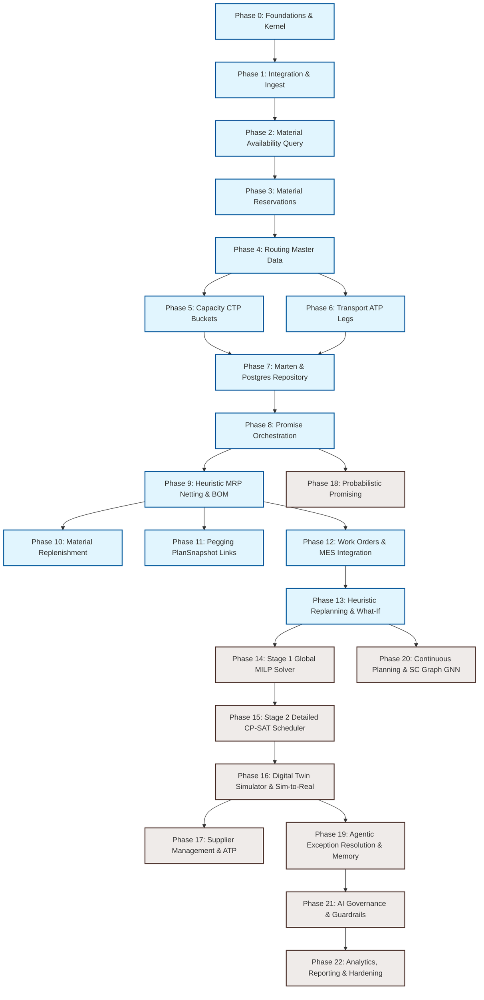

# Phase Planning & Progress
**Version**: 1.2  
**Date**: 2026-05-25  
**Status**: Wave 1 completed

---

## 1. Progress Dashboard

| Phase | Name | Wave | Status | Completion |
|-------|------|------|--------|------------|
| 0 | Foundational Shared Core | 1 | ✔️ Completed | 100% |
| 1 | Integration & Ingest | 1 | ✔️ Completed | 100% |
| 2 | Material Availability Query | 1 | ✔️ Completed | 100% |
| 3 | Material Reservations | 1 | ✔️ Completed | 100% |
| 4 | Routing & Process Master Data | 1 | ✔️ Completed | 100% |
| 5 | Capacity CTP Module | 2 | ✔️ Completed | 100% |
| 6 | Transport ATP Module | 2 | ✔️ Completed | 100% |
| 7 | Postgres/Marten Repository Integration | 2 | ❌ Not Started | 0% |
| 8 | Promise/ATP Orchestrator | 2 | ✔️ Completed | 100% |
| 9 | Heuristic MRP Module | 3 | ✔️ Completed | 100% |
| 10 | Material Replenishment Module | 3 | ✔️ Completed | 100% |
| 11 | Pegging & Traceability | 3 | ❌ Not Started | 0% |
| 12 | Work Orders & Execution Feedback | 3 | ❌ Not Started | 0% |
| 13 | Heuristic Replanning (Disruption Handling) | 3 | ❌ Not Started | 0% |
| 14 | Stage 1 Global Tactical Solver (MILP) | 4 | ❌ Not Started | 0% |
| 15 | Stage 2 Detailed Scheduling (CP-SAT) | 4 | ❌ Not Started | 0% |
| 16 | Digital Twin Simulator & Sim-to-Real | 4 | ❌ Not Started | 0% |
| 17 | Supplier Management & Collaborative ATP | 4 | ❌ Not Started | 0% |
| 18 | Probabilistic Promising | 5 | ❌ Not Started | 0% |
| 19 | Agentic Exception Resolution & Memory | 5 | ❌ Not Started | 0% |
| 20 | Continuous Planning & SC Graph GNNs | 5 | ❌ Not Started | 0% |
| 21 | AI Governance & Guardrails | 5 | ❌ Not Started | 0% |
| 22 | Analytics, Reporting & Hardening | 5 | ❌ Not Started | 0% |

---

## 2. Wave Execution Summary

```
Wave 1: Core Deterministic Foundations [MVP] (Phases 0–4)          ▓▓▓▓▓▓▓▓▓▓▓▓▓▓▓▓▓▓ 100%
Wave 2: Finite Heuristic Planning & Persistence [MVP] (Phases 5–8)  ▓▓▓▓▓▓▓▓▓▓▓▓▓░░░░░ 75%
Wave 3: Demand/Supply Netting & Execution [MVP] (Phases 9–13)       ▓▓▓▓▓▓▓░░░░░░░░░░░ 40%
Wave 4: Advanced AI/ML & Optimization [Post-MVP] (Phases 14–17)     ░░░░░░░░░░░░░░░░░░ 0%
Wave 5: Cognitive, Agentic, & Governance Layer [Post-MVP] (Phases 18–22) ░░░░░░░░░░░░░ 0%
```

---

## 3. Guiding Principles

| # | Principle | Decision |
|---|-----------|----------|
| 1 | **Persistence** | Snapshot-based (Marten documents in PostgreSQL). Integration events published via PostgreSQL Outbox / Marten event stream. **No EventStoreDB dependency.** |
| 2 | **Aggregate API** | `handle : Command -> State -> Result<State * IntegrationEvent list, DomainError>` — strict, deterministic, pure. |
| 3 | **Architecture** | Functional Core / Imperative Shell. Domain projects = pure F#. Infrastructure handles persistence. |
| 4 | **FP/CT Patterns** | State Monad (planner transforms), Writer Monad (KPI accumulation), Validator (command validation), Optics (state navigation). |
| 5 | **Concurrency** | Single writer per scenario. Optimistic concurrency via Marten on `Scenario.Version`. |
| 6 | **Planning Modes** | ReactiveRepair (feasibility restore only), IncrementalInsert (local scope for new demand), FullReplan (structural/scheduled batch). |
| 7 | **Optimizer** | Enhancement layer, not foundation. Heuristic engine first, optimizer replaces/improves heuristic outputs. Manual/heuristic planning must work without optimizer. |
| 8 | **Inventory** | Mutable, external ownership, planner consumes projection. Version increment per update. |
| 9 | **BOM** | Computed at runtime, NOT persisted. Structural changes force FullReplan. |
| 10 | **Pegging** | Part of PlanSnapshot (not independent aggregate). Links DemandId+Version to SupplyRef. Fix/Firm at PlanningRun level. |
| 11 | **Objectives** | Weighted sum of KPIs. Safety stock = soft constraint. Hard constraints: Capacity, Inventory ≥ 0, Fixed peggings. |
| 12 | **Capacity** | Finite capacity only (day-level buckets). CapacityAllocation entity. Σ allocations ≤ bucket capacity. |
| 13 | **Testing** | Unit tests per aggregate, property tests for invariants, integration tests for Promise flow, persist SolverInput/Output. |
| 14 | **Infrastructure** | Marten document store for snapshots & read models. Event bus for integration events. Repositories as record-of-functions. Domain unaware of persistence. Keep 1 previous plan version. |
| 15 | **Solver Sequencing** | Stage 1 Global MILP balances network flow; Stage 2 CP-SAT schedules line sequences; RL agent handles localized simulation feedback. |
| 16 | **AI Governance** | Explicit Autonomy Levels and Action Guardrails. Automated decisions must fall within cost and delivery delay bounds. |

---

## 4. Feature Catalog

### System 1: Medhavi.Integrator (Data Ingestion Layer)

| ID | Feature Name | Scope | Description |
|----|-------------|-------|-------------|
| INT-01 | Multi-source data ingestion | MVP | ERP, WMS, MES, IoT, APIs, unstructured |
| INT-02 | Event normalization | MVP | Schema evolution, data transformation |
| INT-03 | Real-time streaming | MVP | Sub-100ms processing, 5G-ready |
| INT-04 | Data quality assurance | MVP | Validation, cleansing, anomaly detection |
| INT-05 | Master data synchronization | MVP | Cross-system data harmonization |
| INT-06 | IoT sensor integration | Post-MVP | Edge computing, AI nodes |
| INT-07 | API orchestration | MVP | REST, GraphQL, Webhooks |
| INT-08 | Event deduplication | MVP | LRU cache + persistence |
| INT-09 | Anti-corruption layer | MVP | Data validation and transformation boundaries |

### System 2: Nexus (AI-Powered Control Tower)

| ID | Feature Name | Scope | Category |
|----|-------------|-------|----------|
| NX-01 | Event correlation engine | MVP | Real-Time Intelligence |
| NX-02 | Predictive alerting | MVP | Real-Time Intelligence |
| NX-03 | Digital twin telemetry | Post-MVP | Real-Time Intelligence |
| NX-04 | Automated exception alerts | MVP | Real-Time Intelligence |
| NX-05 | Cross-system orchestration | MVP | Real-Time Intelligence |
| NX-06 | Real-time KPI calculation | MVP | Real-Time Intelligence |
| NX-16 | Carbon footprint tracking | Post-MVP | Sustainability |
| NX-24 | Real-time risk command center | MVP | Advanced Analytics |
| NX-27 | Event stream analytics | MVP | Advanced Analytics |
| NX-29 | Autonomous data enrichment | Post-MVP | Master Data Intelligence |

### System 3: ProductionPlanning (APS Engine)

| ID | Feature Name | Core Module | Scope | Wave |
|----|-------------|-------------|-------|------|
| MP-01 | Order promising (ATP/CTP) | Promise/ATP | MVP | 2 |
| MP-02 | Heuristic MRP netting | MRP | MVP | 3 |
| MP-03 | Capacity assignment | Capacity CTP | MVP | 2 |
| MP-04 | Work order planning | Work Orders | MVP | 3 |
| MP-05 | Material availability query | Mat. Availability | MVP | 1 |
| MP-06 | Routing & process master data | Routing | MVP | 1 |
| MP-07 | Transport management | Transport ATP | MVP | 2 |
| MP-08 | Supplier management | Supplier Mgmt | Post-MVP | 4 |
| MP-09 | Pegging & traceability | Pegging | MVP | 3 |
| MP-10 | Campaign management | Campaigns | Post-MVP | 4 |
| MP-11 | Finite capacity planning | Capacity CTP | MVP | 2 |
| MP-12 | Campaign optimization | Campaigns | Post-MVP | 4 |
| MP-13 | Multi-resource scheduling | Capacity CTP | MVP | 2 |
| MP-14 | Dynamic lead time buffers | Capacity CTP | MVP | 2 |
| MP-15 | Production sequencing | Capacity CTP | MVP | 2 |
| MP-16 | Finite/infinite capacity modes | Capacity CTP | MVP | 2 |
| MP-17 | Heuristic MRP execution | MRP | MVP | 3 |
| MP-18 | Lot size & EOQ optimization | MRP | MVP | 3 |
| MP-19 | Supplier collaboration | Supplier Mgmt | Post-MVP | 4 |
| MP-20 | Inventory optimization | Replenishment | MVP | 3 |
| MP-21 | BOM explosion | MRP | MVP | 3 |
| MP-22 | Forecast consumption | MRP | MVP | 3 |
| MP-23 | Multi-hop material flow | Promise/ATP | MVP | 2 |
| MP-24 | Planned supply recommendation | Work Orders | MVP | 3 |
| MP-27 | Production tracking | Work Orders | MVP | 3 |
| MP-28 | Quality & rework hooks | Work Orders | MVP | 3 |
| MP-29 | Multi-objective optimization | Optimization | Post-MVP | 4 |
| MP-30 | Scenario planning | Optimization | Post-MVP | 4 |
| MP-31 | Robust optimization | Optimization | Post-MVP | 4 |
| MP-32 | Real-time replanning | Replanning | MVP | 3 |
| MP-33 | Disruption listeners | Replanning | MVP | 3 |
| MP-34 | Impact assessment | Replanning | MVP | 3 |
| MP-35 | Delta planner | Replanning | MVP | 3 |
| MP-36 | Minimal-move strategy | Replanning | MVP | 3 |
| MP-37 | Rollback/fallback | Replanning | MVP | 3 |
| MP-38 | Scenario runner (sandbox) | What-If | Post-MVP | 5 |
| MP-39 | What-if config structure | What-If | Post-MVP | 5 |
| MP-40 | Scenario diffing/reporting | What-If | Post-MVP | 5 |
| MP-41 | Provider-based architecture | Infrastructure | MVP | 1 |
| MP-42 | Reservations lifecycle | Reservation | MVP | 1 |
| MP-43 | Transport pathfinding | Transport ATP | MVP | 2 |
| MP-44 | Cost & risk scoring | Promise/ATP | MVP | 2 |
| MP-45 | Rework step modeling | Routing | MVP | 1 |
| MP-46 | Regulatory constraints | Transport ATP | MVP | 2 |
| MP-47 | Real-time updates & alerts | Promise/ATP | MVP | 2 |
| MP-48 | Bottleneck identification | Capacity CTP | MVP | 2 |
| MP-49 | Sequence-dependent changeover | Campaigns | Post-MVP | 4 |
| MP-50 | Family batching & CIP windows | Campaigns | Post-MVP | 4 |
| MP-51 | Campaign reduction factor | Campaigns | Post-MVP | 4 |
| MP-53 | Analytics & reporting | Analytics | Post-MVP | 5 |
| MP-54 | Stochastic Programming | Optimization | Post-MVP | 4 |
| MP-55 | Robust Optimization (CVaR) | Optimization | Post-MVP | 4 |
| MP-56 | CP-SAT Stage 2 Scheduler | Optimization | Post-MVP | 4 |
| MP-57 | Digital Twin Simulation | Optimization | Post-MVP | 4 |
| MP-58 | Sim-to-Real Randomization | Optimization | Post-MVP | 4 |
| MP-59 | Agent Memory & Learning | Replanning | Post-MVP | 5 |
| MP-60 | Probabilistic Promising | Promise/ATP | Post-MVP | 5 |
| MP-61 | Continuous Planning Mode | Replanning | Post-MVP | 5 |
| MP-62 | AI Governance & Guardrails | Governance | Post-MVP | 5 |
| MP-63 | SC Graph & GNN modeling | Infrastructure | Post-MVP | 5 |

---

## 5. Wave Structure

| Wave | Name | Phases | Goal |
|------|------|--------|------|
| **1** | Core Deterministic Foundations [MVP] | 0–4 | Establish F# Shared Kernel, Command API, Ingest adapters, Material Availability snapshot query, Material Reservations aggregate, and Routing master data. |
| **2** | Finite Heuristic Planning & Persistence [MVP] | 5–8 | Build Capacity calendar buckets CTP, Transport leg pathfinding ATP, Postgres/Marten persistence, and compose the online Promise/ATP orchestrator. |
| **3** | Demand/Supply Netting & Execution [MVP] | 9–13 | Implement Heuristic MRP netting, BOM explosion, Material Replenishment targets, Pegging Snapshot links, Work Order Release, MES feedback, and Heuristic Replanning. |
| **4** | Advanced AI/ML & Optimization [Post-MVP] | 14–17 | Implement Stage 1 global MILP solver, Stage 2 CP-SAT line sequencer, Digital Twin simulator, and Supplier ATP collaborative parameters. |
| **5** | Cognitive, Agentic & Governance Layer [Post-MVP] | 18–22 | Deliver Probabilistic Promising confidence intervals, Agent Memory exceptions, Continuous event-driven planning, GNN SC graphs, AI Governance guardrails, and hardening. |

---

## 6. Phase Dependency Graph



---

## 7. Cross-Cutting Evolution Arcs

The following capabilities **must grow incrementally** across multiple phases rather than being introduced monolithically. Each arc shows the maturity progression from seed to full capability.

### Arc 1: Telemetry & Observability

| Phase | Maturity | Scope |
|-------|----------|-------|
| 0 | 🟢 Contracts | TelemetryContracts.fs — event shapes, KPI record types, latency/error abstractions |
| 5 | 🟡 Capacity | Capacity utilization %, overload count, bottleneck detection |
| 6 | 🟡 Transport | Pathfinding latency, success/fail rate, cutoff misses |
| 8 | 🟠 Promise | End-to-end promise latency, limiter frequency, cache hit/miss, provider latencies |
| 9 | 🟠 MRP | Netting run latency, planned order counts, safety violations, pegging completeness |
| 22 | 🔴 Full | OTEL distributed tracing, Prometheus metrics, structured JSON logging |

### Arc 2: Caching & Invalidation

| Phase | Maturity | Scope |
|-------|----------|-------|
| 2 | 🟢 Material | MaterialSnapshot caching; invalidation on inventory/supply changes |
| 5 | 🟡 Capacity | Capacity bucket caching; invalidation on calendar/allocation/reservation changes |
| 6 | 🟡 Transport | Transport itinerary caching; invalidation on leg/schedule/capacity changes |
| 8 | 🟠 Promise | Composite cache warming; background rebuild; cache miss fallback |

### Arc 3: Reservation Lifecycle

| Phase | Maturity | Scope |
|-------|----------|-------|
| 3 | 🟢 Material | Full lifecycle (Tentative → Confirmed → Released/Expired/Reduced) |
| 5 | 🟡 Capacity (seed) | Create + Release only; basic aggregate |
| 6 | 🟡 Transport (seed) | Create + Release only; basic aggregate |
| 8 | 🟠 Cross-domain | Full lifecycle for capacity & transport; orchestrated tentative creates across 3 domains |

### Arc 4: Validation & Error Handling

| Phase | Maturity | Scope |
|-------|----------|-------|
| 0 | 🟢 Taxonomy | DomainError DU, PromiseReasonCode, ProviderError types |
| 0 | 🟢 Pipeline | Applicative validator pipeline wired to aggregate commands |
| 1 | 🟡 Ingest | Schema validation, reference integrity, anti-corruption layer |
| 8 | 🟠 Promise | ProviderError → Limiter mapping, degradation patterns, never-dangling reservations |

### Arc 5: Testing Maturity

| Phase | Maturity | Scope |
|-------|----------|-------|
| 0 | 🟢 Foundation | Test project setup, xUnit/FsCheck conventions, domain test helpers |
| 3 | 🟡 Property | Property tests for reservation invariants (qty ≥ 0, state machine rules) |
| 7 | 🟠 Integration | Testcontainers, DB roundtrip, optimistic concurrency conflict scenarios |
| 8 | 🔴 End-to-end | Promise flow integration test (material → capacity → transport → promise) |

---

## 8. Phase Details & Progress

### Phase 0 — Foundational Shared Core
**Wave**: 1 | **Status**: ✔️ Completed

| Sub-Phase | Feature(s) | Description | Exit Gate | Status |
|-----------|-----------|-------------|-----------|--------|
| 0.1 | MP-41 | SharedKernel primitives (Id types, Version, Period, Qty, UoM, Money) | Primitives compiled; JSON serialization & equality unit tests pass. | ✔️ Completed |
| 0.2 | MP-41 | Strict aggregate command API convention (`handle : Cmd -> State -> Result<State*Events, Error>`) | Command handler signatures compile; F# pattern match completeness verified. | ✔️ Completed |
| 0.3 | MP-41 | Base repository port pattern (pluggable interface in-memory implementation) | Repository record-of-functions defined; in-memory mock implementation CRUD tests pass. | ✔️ Completed |
| 0.4 | MP-41 | Error taxonomy & reason code catalog (DomainError DU) | DomainError DUs compile | ✔️ Completed |
| 0.5 | MP-41 | Idempotency & deterministic IDs (hash-based, retry patterns) | Hash-based deterministic ID generator test returns identical IDs for duplicate payloads. | ✔️ Completed |
| 0.6 | MP-41 | Tenant & UTC normalization | Date fields default to/enforce UTC; TenantId propagates through context wrapper. | ✔️ Completed |
| 0.7 | MP-41 | Telemetry contracts (latency, limiter frequency) | TelemetryContracts record definitions compile and model key latency/rate indicators. | ✔️ Completed |
| 0.8 | MP-41 | Applicative command validation pipeline (wire Validator pattern to aggregate commands) | Validation pipeline prevents command execution on invalid inputs; tests verify invalid patterns are caught. | ✔️ Completed |
| 0.9 | MP-41 | FP pattern verification (unit tests for State/Writer/Optics patterns in domain context) | Unit tests confirm optics lens getters/setters and state monad transitions operate correctly. | ✔️ Completed |

---

### Phase 1 — Integration & Pragmatic Ingest
**Wave**: 1 | **Status**: ✔️ Completed

| Sub-Phase | Feature(s) | Description | Exit Gate | Status |
|-----------|-----------|-------------|-----------|--------|
| 1.1 | MP-41 | Integration event envelope & base event contracts (IntegrationEvent DU, EventEnvelope) | EventEnvelope compiles with TenantId, CorrelationId, and base IntegrationEvent payloads. | ✔️ Completed |
| 1.2 | INT-05 | Uom static file parsing & payload contract | Uom files (JSON/CSV) parse completely and map to contracts. | ✔️ Completed |
| 1.3 | INT-05 | UnitConversion static file parsing & payload contract | UnitConversion files (JSON/CSV) parse completely and map to contracts. | ✔️ Completed |
| 1.4 | INT-05 | Product static file parsing & payload contract | Product files (JSON/CSV) parse completely and map to contracts. | ✔️ Completed |
| 1.5 | INT-05 | BomLine static file parsing & payload contract | BomLine files (JSON/CSV) parse completely and map to contracts. | ✔️ Completed |
| 1.6 | INT-05 | StockingPoint static file parsing & payload contract | StockingPoint files (JSON/CSV) parse completely and map to contracts. | ✔️ Completed |
| 1.7 | INT-05 | Supplier static file parsing & payload contract | Supplier files (JSON/CSV) parse completely and map to contracts. | ✔️ Completed |
| 1.8 | INT-05 | Resource static file parsing & payload contract | Resource files (JSON/CSV) parse completely and map to contracts. | ✔️ Completed |
| 1.9 | INT-05 | Routing & RoutingStep static file parsing & payload contract | Routing step files (JSON/CSV) parse completely and map to contracts. | ✔️ Completed |
| 1.10 | INT-05, INT-09 | TransportLeg static file parsing & payload contract | TransportLeg files (JSON/CSV) parse completely and map to contracts. | ✔️ Completed |
| 1.11 | NX-01, NX-06 | CustomerOrder signal file parsing & payload contract | CustomerOrder files (JSON/CSV) parse completely and map to contracts. | ✔️ Completed |
| 1.12 | NX-01, NX-06 | Forecast signal file parsing & payload contract | Forecast files (JSON/CSV) parse completely and map to contracts. | ✔️ Completed |
| 1.13 | INT-05 | InventoryPosition supply file parsing & payload contract | InventoryPosition files (JSON/CSV) parse completely and map to contracts. | ✔️ Completed |
| 1.14 | INT-05 | SupplyOrder status update parsing & payload contract | SupplyOrder status files (JSON/CSV) parse completely and map to contracts. | ✔️ Completed |
| 1.15 | INT-05 | ResourceCalendar downtime and capacity factor parsing | ResourceCalendar files (JSON/CSV) parse completely and map to contracts. | ✔️ Completed |
| 1.16 | MP-27, NX-44 | WorkOrderCompleted MES execution feedback parsing | MES completion events parse completely and map to contracts. | ✔️ Completed |
| 1.17 | MP-27, NX-44 | MaterialReceived ERP/WMS receipt telemetry parsing | MaterialReceived events parse completely and map to contracts. | ✔️ Completed |
| 1.18 | MP-27, NX-44 | ResourceDowntime IoT downtime telemetry parsing | ResourceDowntime events parse completely and map to contracts. | ✔️ Completed |
| 1.19 | MP-27, NX-44 | TransportDelay logistics delay telemetry parsing | TransportDelay events parse completely and map to contracts. | ✔️ Completed |
| 1.20 | INT-04, INT-09 | Schema validation, reference integrity & ACL boundary transformers | Boundary transformers validate fields, enforce reference integrity, and throw ValidationError on failure. | ✔️ Completed |


---

### Phase 2 — Material Availability (Query Service)
**Wave**: 1 | **Status**: ✔️ Completed

**Architecture Note**: Material Availability is a pure **query/knowledge service**. It does NOT make planning decisions — it answers "What material is available?" Used by Promise, MRP, and Material Replenishment.

| Sub-Phase | Feature(s) | Description | Exit Gate | Status |
|-----------|-----------|-------------|-----------|--------|
| 2.1 | MP-05 | InventoryProjection schema (on-hand per Product×SP) | Projection schema handles inventory adjustments and returns on-hand stock for a Product×SP. | ✔️ Completed |
| 2.2 | MP-05 | SupplyOrderProjection (firm inbound with dates) | Query returns list of confirmed supply orders sorted by expected delivery date. | ✔️ Completed |
| 2.3 | MP-05 | MaterialReservationProjection (active totals per Product×SP) | Query retrieves aggregate active reservation quantities (tentative and confirmed) per Product×SP. | ✔️ Completed |
| 2.4 | MP-05 | Safety policy query (safety stock levels per Product×SP) | Policy returns target safety stock levels (by quantity or cover days equivalent) per Product×SP. | ✔️ Completed |
| 2.5 | MP-05 | Net available calculation: OnHand + Inbound − Reservations − Safety | Calculation tested against negative stock cases and returns correct net available quantity. | ✔️ Completed |
| 2.6 | MP-41 | MaterialProvider contract (GetSnapshot, GetSupplierOptions) | Mock MaterialProvider passes ATP integration tests; compiles cleanly with consumer code. | ✔️ Completed |
| 2.7 | MP-05 | Time-phased availability projection stub (period-bucketed view for MRP netting) | Query yields net availability bucketed by day/week intervals over a 90-day horizon. | ✔️ Completed |

---

### Phase 3 — Material Reservations
**Wave**: 1 | **Status**: ✔️ Completed

**Architecture Note**: Material Reservation depends on Material Availability. Prevents double-booking of material.

| Sub-Phase | Feature(s) | Description | Exit Gate | Status |
|-----------|-----------|-------------|-----------|--------|
| 3.1 | MP-05, MP-42 | MaterialReservation aggregate (deterministic ID, idempotency key) | Reservation created with unique ID; duplicates with same idempotency key are rejected. | ✔️ Completed |
| 3.2 | MP-42 | Lifecycle: Tentative → Confirmed → Released/Expired/Reduced | Unit tests verify all valid state transition paths; invalid transitions throw DomainError. | ✔️ Completed |
| 3.3 | MP-42 | Commands: CreateTentative, Confirm, Release, Reduce, Expire | Handler processes all 5 commands, emitting correct domain events for each. | ✔️ Completed |
| 3.4 | MP-42 | Projection (keyed by Product×SP, active totals by state) | Reservation events automatically update projection table totals; tested with event streams. | ✔️ Completed |
| 3.5 | MP-42 | Integration with Material Availability (subtract active reservations) | Net availability queries correctly reduce returned stock values by active reservation amounts. | ✔️ Completed |
| 3.6 | MP-42 | TTL/expiry sweeper | Background process periodically identifies and expires tentative reservations past TTL. | ✔️ Completed |

---

### Phase 4 — Routing & Process Master Data
**Wave**: 1 | **Status**: ✔️ Completed

**Architecture Note**: Routing is **master data** (not owned by Capacity CTP or MRP). Capacity CTP owns Work Routing **knowledge** (looks up routing for capacity checking). Transport ATP owns Transport Routing **knowledge**.

| Sub-Phase | Feature(s) | Description | Exit Gate | Status |
|-----------|-----------|-------------|-----------|--------|
| 4.1 | MP-06 | Routing aggregate & static validations | Routing defined; validation catches invalid sequence ordering, duplicate step IDs, and invalid loop references. | ✔️ Completed |
| 4.2 | MP-06 | Qty-duration, cost, and efficiency math | Duration and cost formulas calculate times and costs using run-rates, setup, and resource efficiencies. | ✔️ Completed |
| 4.3 | MP-45 | Rework/inspection step modeling | Solver nets step-level quantities under scrap yield and loop-back rework rates using fixed-point iteration. | ✔️ Completed |
| 4.4 | MP-06 | Alternate selection & preference priority | Selector matches Fastest/Cheapest/Balanced policies and obeys PreferencePriority. | ✔️ Completed |
| 4.5 | MP-41 | Ingestion mappings | Routing adapter parses and maps SetupHours to step resource setup minutes. | ✔️ Completed |
| 4.6 | MP-06 | Routing & selection unit tests | Tests run green with >90% coverage on validation, calculation, and selection logic. | ✔️ Completed |

---

### Phase 5 — Capacity CTP Module
**Wave**: 2 | **Status**: ✔️ Completed

**Architecture Note**: Capacity CTP **owns Work Routing knowledge**. MRP doesn't need routing — it just calls `CapacityCTP.CheckCapacity(productId, qty, needDate)`.

| Sub-Phase | Feature(s) | Description | Exit Gate | Status |
|-----------|-----------|-------------|-----------|--------|
| 5.1 | MP-13 | Calendar normalization & availability buckets | Base resource calendars successfully normalize to day-level capacity buckets (in hours). | ✔️ Completed |
| 5.2 | MP-03, MP-16 | Capacity bucket calculation (calendar × factor − allocs − reservations − safety) | Calculation accounts for efficiency factors and active reservations; returns correct net capacity. | ✔️ Completed |
| 5.3 | MP-11 | Routing interpreter (internal — looks up Work Routing) | Interpreter parses routing steps to calculate required capacity hours per resource. | ✔️ Completed |
| 5.4 | MP-16 | Finite vs infinite toggle (configurable) | Capacity check bypasses constraint limits when in infinite capacity mode. | ✔️ Completed |
| 5.5 | MP-03 | Earliest-feasible scheduler (CheckCapacity function) | CheckCapacity returns the earliest date with sufficient available capacity buckets. | ✔️ Completed |
| 5.6 | MP-14 | Buffer application (safety, reliability, bottleneck, early/late thresholds) | Scheduler applies safety buffers, sliding dates based on resource-level buffer rules. | ✔️ Completed |
| 5.7 | MP-48 | Overload/bottleneck flagging | Query returns warning indicators when allocated capacity exceeds bucket availability. | ✔️ Completed |
| 5.8 | MP-42 | Capacity reservation aggregate — MVP seed (Create + Release; full lifecycle in Phase 8) | Basic CapacityReservation aggregate handles Create and Release commands; unit tests pass. | ✔️ Completed |
| 5.9 | MP-03 | Capacity bucket caching & invalidation (cache per resource; invalidate on calendar/alloc changes) | Bucketed capacities cached; cache invalidates on capacity reservation/allocation change events. | ✔️ Completed |

---

### Phase 6 — Transport ATP Module
**Wave**: 2 | **Status**: ✔️ Completed

**Architecture Note**: Transport ATP **owns Transport Routing knowledge**. Promise doesn't need transport routing details — it just calls `TransportATP.GetOptions`.

| Sub-Phase | Feature(s) | Description | Exit Gate | Status |
|-----------|-----------|-------------|-----------|--------|
| 6.1 | MP-07 | TransportLeg aggregate (mode, schedule, capacity, cutoff, constraints, reliability, CO2) | TransportLeg aggregate defined; validation checks mode constraints and cutoff bounds. | ✔️ Completed (in MasterData) |
| 6.2 | MP-07 | TransportCalendar projection (departures/arrivals per leg) | Leg calendar projection returns scheduled departure/arrival time windows. | ✔️ Completed (MVP — leg projection in MasterData) |
| 6.3 | MP-43 | K-shortest path finder (Yen's algorithm) | Yen's algorithm implementation tested; returns K feasible transit paths sorted by arrival time. | ✔️ Completed |
| 6.4 | MP-43 | Multi-hop pathfinding (graph-based routing) | Multi-hop pathfinder compiles and traces valid paths across connected nodes. | ✔️ Completed |
| 6.5 | MP-42 | Transport reservations — MVP seed (Create + Release; full lifecycle in Phase 8) | Basic TransportReservation aggregate handles Create, Confirm, Release, and Expire; unit tests pass. | ✔️ Completed |
| 6.6 | MP-44 | Cost modeling (fixed + variable, min-fill, lane preference) | Cost function calculates total transport cost including fixed/variable rates and composite scoring. | ✔️ Completed |
| 6.7 | MP-46 | Regulatory/hazmat constraint enforcement | Pathfinder constraint filter stub in place; full enforcement via leg constraint list in Phase 8. | ✔️ Completed (stub) |
| 6.8 | MP-07 | Transport availability caching & invalidation (cache itineraries; invalidate on leg/schedule changes) | Itineraries cached with TTL; cache invalidates on demand via `InvalidateCache()` call. | ✔️ Completed |

---

### Phase 7 — Postgres/Marten Repository Integration
**Wave**: 2 | **Status**: ❌ Not Started

| Sub-Phase | Feature(s) | Description | Exit Gate | Status |
|-----------|-----------|-------------|-----------|--------|
| 7.1 | MP-41 | Marten configuration (connection pooling, Weasel migration strategy, database schema) | Marten document store initializes; Weasel auto-migrates schemas during startup test. | ❌ Not Started |
| 7.2 | MP-41 | Repository implementation for aggregates (Scenario, Reservations) | Repositories load and save Scenario and Reservation aggregates using Marten sessions. | ❌ Not Started |
| 7.3 | MP-41 | Optimistic concurrency via Marten document version | Concurrent updates to same aggregate throw concurrency/version conflicts as expected. | ❌ Not Started |
| 7.4 | MP-41 | Event storage & integration outbox streams (Marten Async Daemon) | Aggregate events write to event store; Marten Async Daemon catch-up subscriptions dispatch integration events to bounded contexts. | ❌ Not Started |
| 7.5 | MP-41 | Read-model projection infrastructure (Marten inline/async projections for read models) | Marten projections rebuild read models on document changes; verified in database query. | ❌ Not Started |
| 7.6 | MP-41 | Integration test harness (Testcontainers/PostgreSQL, aggregate roundtrip, concurrency tests) | Testcontainers-backed DB integration test suite runs and passes on local runner. | ❌ Not Started |
| 7.7 | INT-01, INT-08 | Nexus idempotent ingest adapter (idempotent by message ID, PostgreSQL Outbox) | Ingestion service writes messages to Outbox table; rejects duplicates by message ID. | ❌ Not Started |

---

### Phase 8 — Promise/ATP Orchestrator (Heuristic ATP/CTP-lite)
**Wave**: 2 | **Status**: ✔️ Completed

**Architecture Note**: Promise is **real-time, per-order, sub-30s**. It orchestrates Material Availability, Material Reservation, Capacity CTP, Transport ATP. It does **NOT** call MRP (too slow, different purpose). Routing selection happens **FIRST**.

| Sub-Phase | Feature(s) | Description | Exit Gate | Status |
|-----------|-----------|-------------|-----------|--------|
| 8.1 | MP-41 | Scenario aggregate (Version, PlanSnapshot, MarkDirty, optimistic concurrency) | Scenario aggregate updates increment Scenario.Version and track dirty state in unit tests. | ✔️ Completed |
| 8.2 | MP-41 | Core policy & SLA presets (Gold/Silver/Bronze presets, merge logic) | Presets defined; merging unit tests verify priority resolution behavior. | ✔️ Completed |
| 8.3 | MP-44 | Scoring type stubs (time/cost/risk/CO2 record shapes; logic wired in Phase 8) | Scoring types compile and support addition/comparison operations. | ✔️ Completed |
| 8.4 | MP-01 | Material ATP service (uses Material Availability) | Query returns material availability date per product; returns Infinite/Unavailable if stock-out. | ✔️ Completed |
| 8.5 | MP-01 | Capacity window finder (uses Capacity CTP) | Capacity query returns start/end dates for routing requirements. | ✔️ Completed |
| 8.6 | MP-01 | Transport ATP integration (uses Transport ATP) | Pathfinder resolves valid transit legs and returns expected arrival date. | ✔️ Completed |
| 8.7 | MP-23 | Multi-hop material flow (graph-based upstream availability) | Orchestrator resolves multi-hop material constraints by tracing upstream bill-of-materials locations. | ✔️ Completed |
| 8.8 | MP-01 | Promise orchestrator (compose all providers, step ordering) | Orchestrator aggregates material, capacity, and transport outputs into a combined promise request. | ✔️ Completed |
| 8.9 | MP-01 | Promise date = max(material_ready, capacity_ready, transport_arrival) | Orchestrator accurately sets promise date using the max of ready dates; unit tests verify calculations. | ✔️ Completed |
| 8.10 | MP-01 | Limiter selection (argmax contributor + rationale) | Output payload identifies the exact bottleneck limiting a promise (Material, Capacity, or Transport). | ✔️ Completed |
| 8.11 | MP-42 | Tentative reservation creation (material/capacity/transport) | Orchestrator successfully creates tentative reservations across all 3 domains, rollback occurs on failure. | ✔️ Completed |
| 8.12 | MP-01 | Priority/full-order/full-delivery enforcement | Order promising respects priority parameters, enforcing full-order delivery rules when requested. | ✔️ Completed |
| 8.13 | MP-41 | Provider injection (light vs full mode) | Config changes switch orchestrator between mock providers and real repository implementations. | ✔️ Completed |
| 8.14 | MP-01 | Risk/confidence stub (deterministic date with confidence=1.0; hook for Phase 18 upgrade) | Response includes risk metadata; returns 1.0 confidence stub; hook compiles cleanly. | ✔️ Completed |
| 8.15 | MP-44 | Cost calculation (material + production + transport + holding + lateness penalties) | Total cost matches expected sum of material, capacity, transit, and late penalty parameters. | ✔️ Completed |
| 8.16 | MP-41 | Promise telemetry instrumentation (latency per provider, limiter frequency, cache hit/miss) | Latencies, cache hits, and limiter counts are successfully published to telemetry sinks. | ✔️ Completed |

---

### Phase 9 — Heuristic MRP Module (Material Requirements Planning)
**Wave**: 3 | **Status**: ✔️ Completed

**Architecture Note**: MRP is a **batch** planning module. It checks capacity via **Capacity CTP** (finite capacity MRP — never assumes infinite). MRP does **NOT** own routing knowledge. Material Replenishment **triggers** MRP when shortfall detected.

| Sub-Phase | Feature(s) | Description | Exit Gate | Status |
|-----------|-----------|-------------|-----------|--------|
| 9.1 | MP-21, MP-17 | Multi-level BOM explosion (recursive, cycle detection, alternates, phantoms) | BOM explodes down all parent-child levels; catches infinite recursion loops and throws exception. | ✔️ Completed |
| 9.2 | MP-02, MP-17 | Material netting (net = OnHand + Inbound − Reservations − Safety) | Net requirement calculations verify correctly across multiple demand intervals. | ✔️ Completed |
| 9.3 | MP-18 | Lot sizing (fixed lot, min lot, EOQ, rounding) | Proposal quantities adjust to respect MOQ, lot size multiples, and rounding rules. | ✔️ Completed |
| 9.4 | MP-02 | Supply order proposals (PO/WO/TO with capacity checking via CTP) | System generates planned purchase, work, and transfer order proposals matching netting shortfalls. | ✔️ Completed |
| 9.5 | MP-22 | Forecast consumption | Incoming order quantities consume forecast values inside the same period. | ✔️ Completed |
| 9.6 | MP-02 | Idempotent proposal generation (keyed by demandId/period/type) | Repeated MRP runs under identical inputs overwrite or preserve proposals without duplicates. | ✔️ Completed |
| 9.7 | MP-02 | Time-phased netting buckets (daily/weekly/monthly) | Netting engine outputs report data correctly bucketed into configured periods. | ✔️ Completed |
| 9.8 | MP-02 | MRP ↔ Capacity CTP integration (call CheckCapacity per WO proposal; adjust dates; try alternates) | Proposals shift forward or fall back onto alternates when capacity check fails; tests verify shifts. | ✔️ Completed |
| 9.9 | MP-04 | SupplyOrder aggregate (Planned → Firm → Released state machine; typed PO/WO/TO; deterministic IDs) | SupplyOrder state transitions and deterministic ID generation verified in unit tests. | ✔️ Completed |

---

### Phase 10 — Material Replenishment Module
**Wave**: 3 | **Status**: ✔️ Completed

**Architecture Note**: Material Replenishment **triggers** MRP — it doesn't generate orders directly. MRP is the single source of truth for supply order generation.

| Sub-Phase | Feature(s) | Description | Exit Gate | Status |
|-----------|-----------|-------------|-----------|--------|
| 10.1 | MP-20 | Stock level monitoring (current vs targets: min/max/safety/cover days; configurable policies) | Stock projections identify min/max/safety levels incorporating cover day policies per Product×SP. | ✔️ Completed |
| 10.2 | MP-20 | Shortfall detection (stock < min/safety) | Shortfalls generate shortfall alerts/events containing Product, SP, and needed quantity. | ✔️ Completed |
| 10.3 | MP-20 | Trigger MRP on shortfall | Shortfall events automatically queue/trigger planning runs for the affected scopes. | ✔️ Completed |
| 10.4 | MP-20 | Replenishment scheduling (configurable interval: hourly/on-demand; batch vs event-triggered) | Scheduler triggers monitoring evaluations at configured intervals; event handler responds immediately. | ✔️ Completed |

---

### Phase 11 — Pegging & Traceability
**Wave**: 3 | **Status**: ✔️ Completed

**Architecture Note**: Pegging is part of **PlanSnapshot** (not independent aggregate). Links DemandId+Version to SupplyRef. Fix/Firm logic handled at PlanningRun level.

| Sub-Phase | Feature(s) | Description | Exit Gate | Status |
|-----------|-----------|-------------|-----------|--------|
| 11.1 | MP-09 | PeggingLink schema (DemandRef, SupplyRef, ReservationRef, PeggedQty, Status) | PeggingLink schema maps demand references directly to supply/reservation references. | ✔️ Completed |
| 11.2 | MP-09 | Pegging projection (bi-directional: by DemandRef and by SupplyRef) | Traceability query returns complete upstream supplies for demand and downstream demands for supply. | ✔️ Completed |
| 11.3 | MP-09 | Replan rules (deterministic, supersede on change, release on cancel) | Replan rules preserve user-firmed pegs while re-pegging unfirmed elements during MRP runs. | ✔️ Completed |
| 11.4 | MP-09 | Integration with MRP (proposals create pegs) | MRP run completes and saves corresponding PeggingLinks in the plan snapshot. | ✔️ Completed |

---

### Phase 12 — Work Orders & Execution Feedback
**Wave**: 3 | **Status**: ✔️ Completed

| Sub-Phase | Feature(s) | Description | Exit Gate | Status |
|-----------|-----------|-------------|-----------|--------|
| 12.1 | MP-04, MP-24 | WO creation from planned supply/operations | System converts planned WO proposals into executable WorkOrder aggregates. | ✔️ Completed |
| 12.2 | MP-04 | WO lifecycle (Planned → InProgress → Completed / Cancelled / PartialComplete) | State machine transitions validate cleanly; invalid status jumps fail with DomainError. | ✔️ Completed |
| 12.3 | MP-28 | Variance/scrap/rework tracking | Yield scraps record correctly, reducing inventory and triggering netting recalculations. | ✔️ Completed |
| 12.4 | MP-27, NX-44 | MES payload generation & idempotent reconciliation | MES progress payloads process idempotently; updates apply to WO state without duplication. | ✔️ Completed |
| 12.5 | MP-04 | Firming workflow (auto-confirm rules when inside firming window; manual approval; policy-driven) | WOs automatically lock/firm when crossing the firming horizon threshold; manual firming compiles. | ✔️ Completed |

---

### Phase 13 — Heuristic Replanning (Disruption Handling)
**Wave**: 3 | **Status**: ✔️ Completed

**Architecture Note**: Replanning is **operational** (react to disruptions quickly, heuristic-based). It does NOT need the Optimizer. Planning modes: ReactiveRepair (feasibility restore), IncrementalInsert (local scope for new demand).

| Sub-Phase | Feature(s) | Description | Exit Gate | Status |
|-----------|-----------|-------------|-----------|--------|
| 13.1 | MP-33 | Disruption listeners (resource down, material delay, quality, MES variance) | Event handlers trigger on external delays/downtime messages and start evaluation runs. | ✔️ Completed |
| 13.2 | MP-34 | Impact assessment (affected ops, promises, supply orders) | Impact analysis lists affected orders, capacity allocations, and delayed customer promises. | ✔️ Completed |
| 13.3 | MP-35 | Delta planner (minimal changes, preserve locks/fixed) | Delta planner calculates a replan limited to affected order graphs, leaving other pegs intact. | ✔️ Completed |
| 13.4 | MP-36 | Minimal-move strategy (minimize churn) | Replan engine minimizes date and quantity moves across firmed POs/WOs. | ✔️ Completed |
| 13.5 | MP-37 | Rollback/fallback (revert if new plan worse) | If the generated plan fails feasibility criteria, system rolls back to the prior plan version. | ✔️ Completed |
| 13.6 | MP-32 | Plan delta emission | Disruption repair emits a plan delta event containing only added, removed, or modified orders. | ✔️ Completed |
| 13.7 | MP-32 | Planning mode dispatcher (ReactiveRepair / IncrementalInsert / FullReplan; mode selection logic) | Dispatcher chooses the correct replanning mode based on disruption severity parameters. | ✔️ Completed |

---

### Phase 14 — Stage 1 Global Tactical Solver (MILP)
**Wave**: 4 | **Status**: ❌ Not Started

**Architecture Note**: Optimization is a **separate, cross-domain module** (not a sub-module of MRP). Stage 1 MILP balances network flow and resource group capacity loading. Reuses existing availability and CTP functions.

| Sub-Phase | Feature(s) | Description | Exit Gate | Status |
|-----------|-----------|-------------|-----------|--------|
| 14.1 | MP-29 | Reuse MRP, Capacity CTP, and Transport ATP functions (no code duplication) | Optimizer consumes standard CTP/ATP data structures without creating separate models. | ❌ Not Started |
| 14.2 | MP-29 | Solver abstraction layer (CPLEX/OR-Tools MILP) | OR-Tools MILP solver compiles; returns optimal flow decisions for a small test network. | ❌ Not Started |
| 14.3 | MP-31 | Multi-objective optimization weighting (lateness, cost, utilization, CO2, churn) | Objective function minimizes lateness/cost based on user weights; verified in solver logs. | ❌ Not Started |
| 14.4 | MP-54, MP-55 | Stochastic Programming (two-stage scenario trees) & Robust CVaR | CVaR models risk bounds; solves stochastic scenario tree within feasibility constraints. | ❌ Not Started |
| 14.5 | MP-29 | Heuristic fallback on solver timeout/gap | Fallback heuristic executes when solver exceeds maximum time limit, outputting valid plan. | ❌ Not Started |
| 14.6 | MP-29 | State Monad transformation for PlanSnapshot & Writer Monad KPI accumulation | Optimizer monads return updated PlanSnapshot alongside accumulated objective KPIs. | ❌ Not Started |

---

### Phase 15 — Stage 2 Detailed Scheduling (CP-SAT)
**Wave**: 4 | **Status**: ❌ Not Started

**Architecture Note**: CP-SAT solves the detailed line sequencing and campaign setup problem (Continuous/Hourly buckets, 1-2 weeks horizon).

| Sub-Phase | Feature(s) | Description | Exit Gate | Status |
|-----------|-----------|-------------|-----------|--------|
| 15.1 | MP-56 | OR-Tools CP-SAT detailed scheduling model | CP-SAT scheduler outputs sequence-dependent machine scheduling order for machine lines. | ❌ Not Started |
| 15.2 | MP-49 | Sequence-dependent changeover time and cost matrices | Scheduling sequence accounts for setup times; avoids costly transitions in test trials. | ❌ Not Started |
| 15.3 | MP-50 | Family batching and CIP (cleaning) window constraints | Scheduler schedules CIP windows automatically between different product family batches. | ❌ Not Started |
| 15.4 | MP-51 | Min run, campaign length limits, and capacity reduction factors | CP-SAT model respects run length limits and resource capacity reduction constraints. | ❌ Not Started |

---

### Phase 16 — Digital Twin Simulator & Sim-to-Real
**Wave**: 4 | **Status**: ❌ Not Started

| Sub-Phase | Feature(s) | Description | Exit Gate | Status |
|-----------|-----------|-------------|-----------|--------|
| 16.1 | MP-57 | High-fidelity shop floor simulator (changeovers, CIP, stochastic breakdowns) | Simulator runs discrete event scenarios; models breakdowns and outputs simulated KPI reports. | ❌ Not Started |
| 16.2 | MP-57 | Telemetry-driven calibration loop (MES actual durations → simulator inputs) | Calibration service updates simulation parameters using historical execution actuals. | ❌ Not Started |
| 16.3 | MP-58 | Domain Randomization pipeline (bridging sim-to-real gap for RL agent training) | Randomizer outputs randomized environments; compiles successfully with training agents. | ❌ Not Started |

---

### Phase 17 — Supplier Management & Collaborative ATP
**Wave**: 4 | **Status**: ❌ Not Started

| Sub-Phase | Feature(s) | Description | Exit Gate | Status |
|-----------|-----------|-------------|-----------|--------|
| 17.1 | MP-08 | Supplier & SupplierOffer aggregates (MOQ, lot sizes, lead-times, reliability) | Supplier aggregates compile; validation rules enforce supplier MOQ and lead times. | ❌ Not Started |
| 17.2 | MP-19 | Supplier capacity/window availability & ATP queries (shortfall vs always) | ATP queries dynamically check supplier availability windows during pathfinding. | ❌ Not Started |
| 17.3 | MP-08 | Closed-loop ML hooks for supplier lead-time & reliability predictions | Prediction engine outputs lead time estimates based on supplier delivery history. | ❌ Not Started |

---

### Phase 18 — Probabilistic Promising
**Wave**: 5 | **Status**: ❌ Not Started

| Sub-Phase | Feature(s) | Description | Exit Gate | Status |
|-----------|-----------|-------------|-----------|--------|
| 18.1 | MP-60 | Probability distributions integration (log-normal transit, beta supplier) | Distributions sample lead times correctly; verified via statistical test runs. | ❌ Not Started |
| 18.2 | MP-60 | G/G/1 queueing models for capacity waiting times | Queueing logic returns expected wait times under variable load patterns. | ❌ Not Started |
| 18.3 | MP-60 | Probabilistic Promising response (p50/p85/p95 confidence intervals) | Promise response includes p50, p85, and p95 confidence intervals in output payload. | ❌ Not Started |

---

### Phase 19 — Agentic Exception Resolution & Memory
**Wave**: 5 | **Status**: ❌ Not Started

| Sub-Phase | Feature(s) | Description | Exit Gate | Status |
|-----------|-----------|-------------|-----------|--------|
| 19.1 | MP-38, MP-39 | What-if Config structure & Sandbox simulation manager | Sandbox runner isolates plan modifications; runs trials without affecting main store. | ❌ Not Started |
| 19.2 | MP-40 | Scenario diffing & natural language recommendation card synthesis | Difference tool maps cost/KPI changes; generates recommendation cards for operator. | ❌ Not Started |
| 19.3 | MP-59 | Three-tier memory engine (Episodic, Semantic, Procedural) | Agent queries past actions (episodic) and patterns (semantic) to propose solutions. | ❌ Not Started |
| 19.4 | MP-59 | Planner feedback loop (adapting procedural weights based on overrides) | Feedback loop adjusts procedural policy weights when user overrides suggestions. | ❌ Not Started |

---

### Phase 20 — Continuous Planning & SC Graph GNNs
**Wave**: 5 | **Status**: ❌ Not Started

| Sub-Phase | Feature(s) | Description | Exit Gate | Status |
|-----------|-----------|-------------|-----------|--------|
| 20.1 | MP-61 | Event-driven micro-replanning engine (telemetry triggers → delta sandbox run) | Disrupted telemetry events automatically launch low-latency sandbox planning runs. | ❌ Not Started |
| 20.2 | MP-63 | Supply chain directed multi-graph representation | Multi-graph structure maps dependencies across suppliers, SPs, resources, and orders. | ❌ Not Started |
| 20.3 | MP-63 | GNN model integration for risk propagation & cascade predictions | GNN model predicts cascade delays and risk scores across nodes in the network graph. | ❌ Not Started |

---

### Phase 21 — AI Governance & Guardrails
**Wave**: 5 | **Status**: ❌ Not Started

| Sub-Phase | Feature(s) | Description | Exit Gate | Status |
|-----------|-----------|-------------|-----------|--------|
| 21.1 | MP-62 | Autonomy level presets (Level 1: Advisory to Level 3: Full Autonomy) | Presets enforce strict manual approval vs autonomous execution limits. | ❌ Not Started |
| 21.2 | MP-62 | Guardrail boundary enforcement (cost delta < $1k, delay < 2h, zero pre-emptions) | Automated actions exceeding limits trigger immediate block and operator alerts. | ❌ Not Started |
| 21.3 | MP-62 | Immutable audit log mapping & scenario rollback endpoint contract | Audit service records all automated decisions to a signed, immutable log. | ❌ Not Started |

---

### Phase 22 — Analytics, Reporting & Hardening
**Wave**: 5 | **Status**: ❌ Not Started

| Sub-Phase | Feature(s) | Description | Exit Gate | Status |
|-----------|-----------|-------------|-----------|--------|
| 22.1 | MP-53 | KPI projection schemas (OTD, utilization, inventory turns, accuracy) | OTD, inventory turn, and utilization schemas query and return correct KPIs. | ❌ Not Started |
| 22.2 | MP-41 | Production hardening: RBAC, TLS 1.3, Secrets, WAF, multi-tenant locks | External vulnerability scans and multi-tenant isolation tests pass. | ❌ Not Started |
| 22.3 | MP-41 | Distributed tracing (OTEL), structured JSON logging, Prometheus metrics | OpenTelemetry trace IDs and Prometheus metrics are scraped successfully under load. | ❌ Not Started |
| 22.4 | INT-02 | Ingest event normalization (schema evolution, data transformation) | Transformer mapping supports converting older payload formats to the current schema. | ❌ Not Started |
| 22.5 | NX-02 | Alerting on ingest failures (DLQ notifications) | Ingest exceptions catch, route payloads to Dead Letter Queue (DLQ), and write alerts to log. | ❌ Not Started |
| 22.6 | INT-03 | Event streaming infrastructure (external broker integration: RabbitMQ/Kafka) | Outbox adapter forwards events to external broker; subscriber receives events with back-pressure support. | ❌ Not Started |

---

## 9. Alignment with Redesign Principles

| # | Redesign Principle | Phase(s) | Notes |
|---|-------------------|----------|-------|
| 1 | Snapshot-based persistence (Marten) | 0 (Scenario), 9 (PlanSnapshot) | No EventStoreDB dependency for planning state |
| 2 | Strict aggregate command API | 0 (all aggregates follow pattern) | `handle : Cmd -> State -> Result<State*Events, Error>` |
| 3 | Functional Core / Imperative Shell | All domain phases | Domain = pure F#, Infrastructure = persistence |
| 4 | State Monad (planner transforms) | 14 (Optimizer) | Used inside Stage 1 global solver transitions |
| 5 | Writer Monad (KPI accumulation) | 14 (Optimizer) | Accumulate KPIs during optimization runs |
| 6 | Validator (command validation) | 0 (all aggregates) | Applicative validation for incoming commands |
| 7 | Optics (state navigation) | 0, 14 | Lenses for nested PlanSnapshot modifications |
| 8 | Single writer per scenario | 0, 7 (Scenario.Version) | Marten optimistic concurrency checks |
| 9 | ReactiveRepair planning mode | 13 (Replanning) | Feasibility restore only |
| 10 | IncrementalInsert planning mode | 13 (Replanning) | Local scope for new demand |
| 11 | FullReplan planning mode | 9-13 (night batch) | Structural/scheduled batch runs |
| 12 | Heuristic engine first | 0-13 (Waves 1-3) | Manual/heuristic planning works without optimizer |
| 13 | Optimizer as enhancement | 14 | Reuses existing functions, replaces heuristic outputs |
| 14 | BOM explosion not persisted | 9 (MRP) | Computed at runtime |
| 15 | Pegging in PlanSnapshot | 11 | Not independent aggregate |
| 16 | Safety stock = soft constraint | 9 (MRP) | Hard constraints: capacity, inventory ≥ 0, fixed pegs |
| 17 | Inventory = mutable, external | 2 (Material Availability) | Planner consumes projection |
| 18 | Integration events via Marten stream | 0, 7 | Audit + system integration only |
| 19 | Keep 1 previous plan version | 0, 9 | Reconstructable from snapshots |
| 20 | Finite capacity only | 5 (Capacity CTP) | Day-level buckets, Σ allocs ≤ capacity |

---

*** End of Document ***
